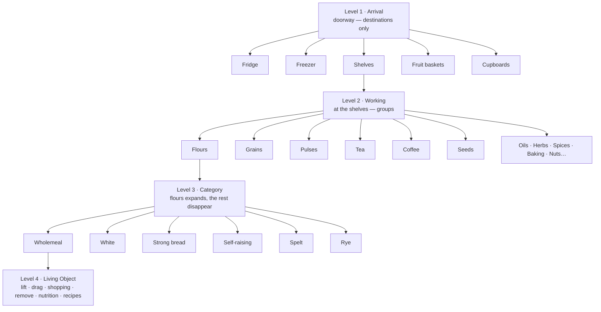

# Living Home — Spatial Blueprint (Living Larder)

**Date:** 2026-08-01 · **Risk:** 🔴 RED — canonical Living Home architecture.
**Status:** Design blueprint. Implements nothing, generates nothing, creates no asset, mints no owner.
**Author of record:** Colin Clapson (Home Owner) · drafted by Claude under the Engineering Workflow.
**Rollback:** `rollback/living-home-spatial-blueprint-base` → `e1b38dc8`.

**Governing documents (prevail on any conflict; cited, never overridden):**
`README.md` (architecture bootstrap) · **LARDER1** `LARDER_ROOM_NORTH_STAR_ARCHITECTURE.md` (the room's North Star — owns *what the room is*, the interaction outcomes, and each owner) · **LARDER2** `LIVING_LARDER_INTERIOR_ARCHITECTURE.md` (interior design — furniture, wings, Two-Layer Law) · **LARDER3** `LIVING_LARDER_INTERACTION_CONSTITUTION.md` (behaviour under the hand) · **LHDC1** `LIVING_HOME_DESIGN_CONSTITUTION.md` · **ASSET1** `LIVING_LARDER_ASSET_LIBRARY.md` · **D-017 / D-018** and the Visual Acceptance Decisions (`LIVING_LARDER_VISUAL_ACCEPTANCE_DECISIONS.md`) · the **Stage + Interactive Props** investigation (`docs/investigations/LIVING_HOME_STAGE_AND_INTERACTIVE_PROPS_ARCHITECTURE.md`, Model B, approved).

> **What this document is.** The **definitive spatial blueprint of the Living Larder** — how the room is laid out in space, and how a household *moves through it by proximity* rather than by navigating pages. It is the spatial face of Model B: it fixes the room's zones, the working positions, and the four levels of approach that every future Living Home implementation must follow.
>
> **What this document is not.** Not an implementation. No route, component, token, schema, migration, capability, string, asset or business-logic change occurs because it exists, and no runtime code reads it. It **restates no rule**: interaction *outcomes and owners* remain LARDER1's (Domain 30 Pantry, Domain 15 Shopping, Domain 2 Food identity); *interior design and the Two-Layer Law* remain LARDER2's; *interaction behaviour and motion character* remain LARDER3's and the UI Architecture's; *materials, stillness and light* remain the Kept Room Translation's. On any question of rule, that owner prevails and this document is corrected.

---

## 1. Canonical room layout

The Living Larder is one **warm, handcrafted, timeless** room, experienced **front-on**: the household stands as if in the doorway, the primary working wall directly ahead. Materials and feeling are LARDER2's and the Kept Room Translation's, restated here only as spatial fact:

- **Warm oak cabinetry**, **lime-plaster walls**, **stone or timber worktops**; cream-and-honey palette; calm hospitality — *"a warm, lived-in home where someone has already thought about dinner."*
- **Natural daylight enters from the window on the RIGHT.** *(See §13 — this is the light the approved room asset already establishes; it is recorded here as the Larder's canonical light and reconciled against LARDER2's house-wide phrasing.)*
- The room is **still**. Only the household's provisions move (LIVINGHOME1 — *the house holds still; the life moves*, cited).

**Diagram A — canonical room layout (front-on elevation).**

```
        lime plaster · warm oak · stone worktop · daylight from the RIGHT
   ┌───────────────────────────────────────────────────────────────────────┐
   │                                                             ░░ window ░░│
   │  ┌──────────┐    ┌───────────────────────────┐            ░░ daylight ░░│
   │  │  FRIDGE  │    │                           │             ╲  from right│
   │  │  chilled │    │     PRIMARY  SHELVING     │              ╲           │
   │  ├──────────┤    │      — THE HERO —          │       ┌───────────────┐ │
   │  │ FREEZER  │    │   open shelves, daily-use  │       │ FRUIT & VEG   │ │
   │  │  frozen  │    │   flours·grains·pulses·    │       │ BASKETS       │ │
   │  └──────────┘    │   tea·coffee·seeds·oils…   │       │ fresh produce │ │
   │                  └───────────────────────────┘       └───────────────┘ │
   │  ▄▄▄▄▄▄▄▄▄▄▄▄▄▄▄▄▄▄▄▄▄▄▄▄▄▄▄▄▄▄▄▄▄▄▄▄▄▄▄▄▄▄▄▄▄▄▄▄▄▄▄▄▄▄▄  ← worktop line │
   │  │ LOWER CUPBOARDS — tins, long-life, heavier storage  │                │
   │  └──────────────────────────────────────────────────────┘              │
   │        L E F T              C E N T R E                 R I G H T        │
   └───────────────────────────────────────────────────────────────────────┘
                   ▲  you stand here, in the doorway, facing the shelving
```

The **primary shelving is the hero**: centred, closest, the thing the household naturally walks to. The cold stores sit off to the **left**; the window, fresh produce and daylight to the **right**; the **lower cupboards** run **below** the worktop line as the home for tins and heavier storage.

---

## 2. Spatial zoning

The zones are a concrete placement of LARDER2's wings (cited) — this blueprint *positions* them; it does not redesign them.

| Zone | Position | LARDER2 wing (cited) | Holds | Storage character |
|---|---|---|---|---|
| **Pantry shelving** | Centre, front (hero) | Wing A Dry Store · Wing B Daily Rhythm | flours, rice, pasta, grains, pulses, herbs, seeds, coffee, tea, oils | open shelving — **daily-use**, read by eye |
| **Fridge** | Left, upper | Wing C Cool Store | fresh chilled foods | behind a cold door |
| **Freezer** | Left, lower | Wing C Cool Store | frozen foods | behind a cold drawer |
| **Lower cupboards** | Below the worktop | Wing A / Wing E Working House | tins (beans, tomatoes, sweetcorn, soups, coconut milk, tuna), long-life goods | closed storage — **heavier, out of daily sight** |
| **Fruit & veg baskets** | Right, by the window | Wing D Hospitality · Wing F Seasonal & Growing | fresh fruit, vegetables, herbs | open baskets in daylight — **freshest, most visible** |
| **Window & daylight** | Right | (light, not storage) | — | environment only; never interactive |

**Zoning law (why it is arranged this way).** Freshest and most-used things live in light and in reach (centre + right); cold keeping is grouped to one side (left); heavy, long-life and infrequent storage sits low and closed (below). The arrangement encourages healthier habits by keeping fresh food visible — *without tracking any date the room does not own* (LARDER1 §3; Domain 30 owns no time, cited).

---

## 3. User movement model

The household **moves by proximity, never by pages.** Every action is *taking a few steps closer* to what interests them; every step *reduces* what is on show. The mental model is **"I'm walking over to the shelves,"** never *"I'm opening another screen"* (LARDER3 §2 — the natural journey, cited).

Three laws govern movement:

1. **Approach reveals; retreat restores.** Moving closer shows more of *one* thing and less of everything else. Stepping back returns to the calm wider view. The inverse of every approach is a retreat.
2. **Never zoom, crop, or enlarge.** Getting closer is *a new, carefully composed environment* — a fresh Stage — never a scaled bitmap of the wider one (D-018; this document §11).
3. **Complexity only ever falls.** No approach may present *more* controls, chrome or choices than the position before it. If a step would add complexity, the design is wrong (LARDER3 rejection criteria, cited).

**Diagram C — user movement (proximity, not pages).**

```
  DOORWAY                 AT THE SHELVES            ONE CATEGORY            ONE OBJECT
  (calm, whole room)      (grouped)                 (expanded)              (alive)
  ┌─────────────┐  step   ┌─────────────┐  step     ┌───────────┐  step     ┌────────┐
  │ □ □ □ □ □    │  ────►  │ flours grains│  ────►    │ wholemeal │  ────►    │  jar   │
  │ destinations│  closer │ pulses tea…  │  closer   │ white rye │  closer   │ lifts, │
  │ only        │         │ (still calm) │           │ spelt…    │           │ acts   │
  └─────────────┘  ◄────   └─────────────┘  ◄────     └───────────┘  ◄────     └────────┘
                  step back              step back               step back
     Level 1                Level 2                  Level 3                  Level 4
   less on show ────────────────────────────────────────────────────────►  most focused
```

---

## 4. Working positions

A **working position** is a place the household naturally stands to do one kind of thing — the spatial replacement for "a page." Each is calm, composed, and (eventually) **its own carefully composed environment** (§11). The canonical positions:

| Working position | Reached from | What the household does here |
|---|---|---|
| **Arrival** (doorway) | app entry / any retreat | choose a destination — nothing more |
| **At the shelving** | Arrival → Shelves | see grouped provisions; pick a category |
| **In a category** | shelving → a group | see the individual items in that one group |
| **At the fridge** | Arrival → Fridge | open the cold door; handle chilled items |
| **At the freezer** | Arrival → Freezer | open the cold drawer; handle frozen items |
| **At the cupboards** | Arrival → Cupboards | open the doors; handle tins & long-life |
| **At the baskets** | Arrival → Fruit | handle fresh produce in window light |

Each working position **owns no fact** — it is a *view onto* Domain 30/15/2 (Two-Layer Law, LARDER2 §II.10, cited). Positions are destinations, not state.

---

## 5. Navigation hierarchy

Four levels of approach. The rule at every level: **only the thing approached expands; everything else recedes or disappears.**

- **Level 1 · Arrival Position.** The doorway. The household sees **only destinations** — *Fridge, Freezer, Shelves, Fruit, Cupboards.* **No products.** The room is at its calmest.
- **Level 2 · Working Position.** One area is chosen (e.g. *Shelves*). The household stands before it; **products remain grouped** — *Flours, Grains, Pulses, Tea, Coffee, Seeds, Herbs, Spices, Oils, Baking, Nuts, Rice, Pasta.* Still calm; still no individual items.
- **Level 3 · Category Position.** One group is chosen (e.g. *Flours*). **Only that category expands** — *Wholemeal, White, Strong Bread, Self-Raising, Spelt, Rye.* Everything else disappears. (Tea → English Breakfast, Earl Grey, Chamomile, Peppermint, Lemon & Ginger. Coffee → Beans, Ground, Instant, Decaf.)
- **Level 4 · Living Object.** One object is in hand. It can **lift, move, drag, return, add to shopping, remove, and show nutrition / recipes / household usage.** The room stays still; only the object comes alive.

**Diagram D — navigation hierarchy.**



Each **owner touched at each level** is unchanged: L1–L3 are *presentation* readings of Domain 30 (what the household keeps) resolved against Domain 2 (identity); L4's *add to shopping* is Domain 15, *remove/return* is Domain 30 soft-delete/restore, and *nutrition/recipes/usage* are the registered permission-aware `pantry` Companion capability (LARDER1 §§2, 8; LARDER3 §§5–6, cited).

---

## 6. Stage vs Living Objects — ownership

This blueprint inherits Model B (approved) and the Two-Layer Law:

- **The Stage (House-class, byte-constant).** The room and its light: walls, floor, window, daylight, and all **fixed furniture** (shelving, cupboard carcasses, drawers, worktops). The Stage is a **House-class asset** in the House Register; it is verified byte-constant and **owns no fact**. It provides atmosphere and defines the anchor slots where objects sit. It is never a dashboard, never a menu, never a card.
- **The Living Objects (Life-class, data-borne).** The **provisions** — jars, tins, bottles, produce, packets. Each Living Object is **one Domain-30 record** shown as an **approved vessel asset** (Life Register § J, checksum-bound) carrying a **runtime label** (its name in crisp UI text, never painted into the image). Living Objects are the **only** things that map to facts and the **only** things that move.

| | Stage | Living Object |
|---|---|---|
| Class | House (byte-constant) | Life (data-borne) |
| Register | House Register | Life Register § J |
| Owns a fact? | **No** (Two-Layer Law) | Represents one Domain-30 record |
| Moves? | Never (the house holds still) | Yes (lift/drag/return) |
| Examples | walls, window, shelves, cupboards, worktops | jars, tins, bottles, produce |

**Decision rule (canonical).** *If the household can pick it up, move, drag, open its contents out, add it to shopping or discard it → Living Object. If it never changes → Stage.*

---

## 7. Furniture ownership

Furniture is **Stage**, and by the Two-Layer Law it **owns no fact** — *an empty spice rack is still a spice rack* (LARDER2 §I.4, cited). Precisely:

- **Containers of place** — shelves, cupboards, drawers, baskets — are furniture (Stage). They *hold* Living Objects but store no data (LARDER3 §3.1, cited).
- **Doors and openings** — the fridge door, the freezer drawer, the cupboard doors — are furniture whose **open/closed is a *view state*, not a stored fact.** Opening reveals the household's *real* contents (Domain 30), never a fabricated interior (LARDER3 §3.3, cited). A door is part of the Stage with an animated presentation state; it is **not** itself a Living Object.
- **Placement the household authors** (where a jar stands, in what order) is a lawful use of an *existing* fact (`user_pantry_items.category` / `sortOrder`), not a new one (LARDER3 RM4, cited). The furniture never invents order.

No furniture in any Living Home room may become a button, a card, or a store of state.

---

## 8. Future room consistency

This blueprint is **not Larder-only** — it is the template for **every future Living Home room** (Cookbook, Shopping, Diary, and rooms not yet named). Each future room inherits, unchanged:

1. **One still Stage** (House-class) + **Living Objects** (Life-class) — no exceptions.
2. **Movement by proximity**, in the same four levels: *Arrival → Working position → Category → Living Object.*
3. **Complexity only ever falls** on approach; never a page, menu, dashboard or card grid.
4. **Every action routes to an existing owner** — a room mints no fact and no store (LARDER1 §2 pattern).
5. **Never zoom/crop/enlarge**; each closer position is its own composed environment.
6. **Labels are runtime text**, never painted into imagery.

A future room is *rejected* if it navigates by pages, makes furniture interactive, paints product names into the Stage, adds complexity on approach, or owns a fact its domain already owns.

---

## 9. Mobile considerations

The mobile experience is the **same room, same movement, same owners** — only the gesture vocabulary differs (LARDER1 §5, cited).

- **Same four levels.** Arrival → Working → Category → Object, tapped rather than walked. Progressive disclosure *is* the mobile design: one destination fills the screen at a time, which is calm on a small display.
- **Tap replaces approach; a back gesture replaces retreat.** Every desktop outcome is reachable by touch; nothing is desktop-only, and nothing is mobile-only.
- **Drag has a non-drag equivalent everywhere** (LARDER1 §10; LARDER3, cited): at Level 4 every action exists as a tappable control, so *add to shopping* and *remove* never require a drag.
- **The Stage scales, it does not re-crop.** The composed environment for each position is authored to read on a narrow frame; the room is never a different layout on mobile — it is the same room, closer.

---

## 10. Accessibility considerations

- **Every Living Object is a real control** (button/link) with an accessible name carrying its identity and status ("Wholemeal flour, running low"). The decorative Stage is `aria-hidden`.
- **No action requires drag, hover, or fine motor precision** — each has a keyboard/tap/switch equivalent (LARDER3, cited).
- **Status is never colour-only.** "Running low" is words as well as any visual cue; no meaning rests on colour alone.
- **Motion is optional.** Under `prefers-reduced-motion`, approach/retreat and object animation reduce to instant state changes; the room is fully usable with no motion. Motion is the UI Architecture's to value; this document sets none.
- **Reading order follows the room** — destinations, then the chosen area, then its items — so a screen-reader user moves through the same proximity model as a sighted user.

---

## 11. Asset implications

The spatial model is deliberately **asset-frugal**, because the split between Stage and Living Objects keeps generation minimal:

- **Environments are few; products are data.** Each **working position** becomes **one composed environment plate** (a Stage). The **individual products are never images** — a shared vessel asset (a jar, a **tin**, a bottle) carries the specific name as runtime text. *One tin shape carries a hundred labels.* This is what stops the room ballooning into hundreds of images.
- **Minimum plates, by position** (authored incrementally, never all at once): Arrival room · At-the-shelving · Fridge interior · Freezer interior · Cupboards interior · Baskets close. Each is its **own** render (never a zoom/crop of another — D-018).
- **What exists today** (verified on disk): the wide room photo; **28 jar** vessels; **2 produce** cut-outs (apple, broccoli); **10 joinery** pieces. **What is a proven gap:** the front-on Arrival plate, the at-the-shelving plate, cold-store and cupboard interiors, the **tin** vessel, bottle and basket vessels — none exist and all were searched across every worktree.
- **Governance of new assets is unchanged.** Stage plates enter the House Register; Living Object vessels enter the Life Register § J — both **checksum-bound to Home-Owner visual approval** (ASSET1; LHDC1). External (OpenAI) generation is a governed act under the capability boundary and the agreed cost threshold; nothing is generated by this document.

---

## 12. Implementation roadmap

Design-only sequencing (no step is started by this document):

- **Phase 0 — Adopt this blueprint** as the canonical spatial law.
- **Phase 1 — The vertical proof (shelving path).** Two Stage plates (Arrival room + At-the-shelving) and the existing jar Living Objects: five jars on one shelf, *lift · drag-to-Shopping (keeps the staple) · drag-to-Bin (reversible) · return*, desktop + mobile. Reuses the Living Object runtime that already exists in `larder-room.tsx` (its dnd, Shopping/Bin, reversible soft-delete, honest gaps). No new product images.
- **Phase 2 — Full shelving categories** (Levels 2–3 across all groups); author the **tin** vessel → open the **cupboards** working position (tins & long-life).
- **Phase 3 — Cold stores.** Fridge and freezer interiors + the cold-door view state.
- **Phase 4 — Baskets & fresh produce** in window light (Wing F Seasonal).
- **Phase 5 — Propagate the pattern** to the next Living Home room, unchanged.

Each phase is gated by the existing pipeline: Home-Owner visual acceptance for every plate and vessel, and the verifier for register/ownership discipline. The room supersedes the current `/pantry` DOM-overlay presentation once Phase 1 is accepted.

---

## 13. Trust check & open reconciliation

- **Light direction (must be ratified).** LARDER2 cites a house-wide *"one morning sun, upper-left, in every room forever"* (through the Kept Room Translation / Experience Blueprint). This blueprint records the Larder's daylight as entering from the **RIGHT**, because (a) the **approved** room asset already depicts right-side daylight (accepted under D-018), and (b) the Home Owner has directed a right-hand window with fruit baskets beneath it. This is a **room-specific divergence** from the house-wide phrasing. *Recommended action:* the Experience Blueprint owner ratifies right-hand daylight for the Larder (or restates the house law as "consistent per-room daylight" rather than a fixed compass direction). Until ratified, this is the one **Assumed** claim in the blueprint; every other spatial claim is grounded in a cited owner or a verified on-disk asset.
- **Superseded presentation.** The brass-plaque DOM overlay currently on `/pantry` (`larder-plaque-room.tsx`) and its bitmap-zoom category page are **superseded** by this blueprint (they zoom/crop the overview, which §3 forbids). They remain only until Phase 1 replaces them.
- **New composition acknowledged.** The front-on room with fridge/freezer and lower cupboards is a **new composition** authored by the Home Owner; it extends LARDER2's wings into a fixed placement and changes the room's *layout*, not its *soul* or its *owners*.

## Rollback

Design-only; nothing to roll back but this document. Rollback point: `rollback/living-home-spatial-blueprint-base` → `e1b38dc8`. No runtime code, asset, image, schema or owner was touched.
