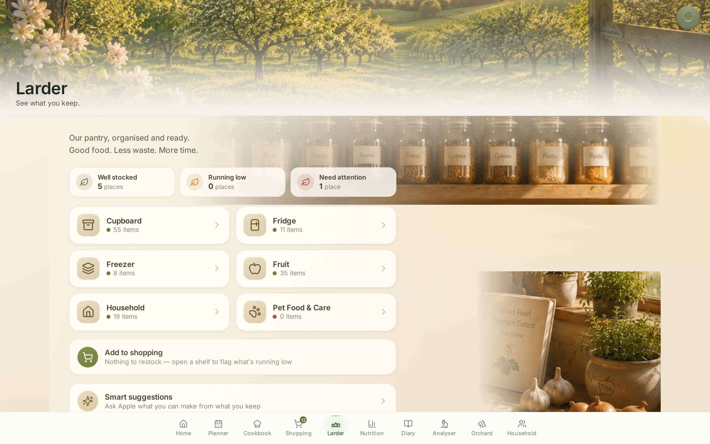
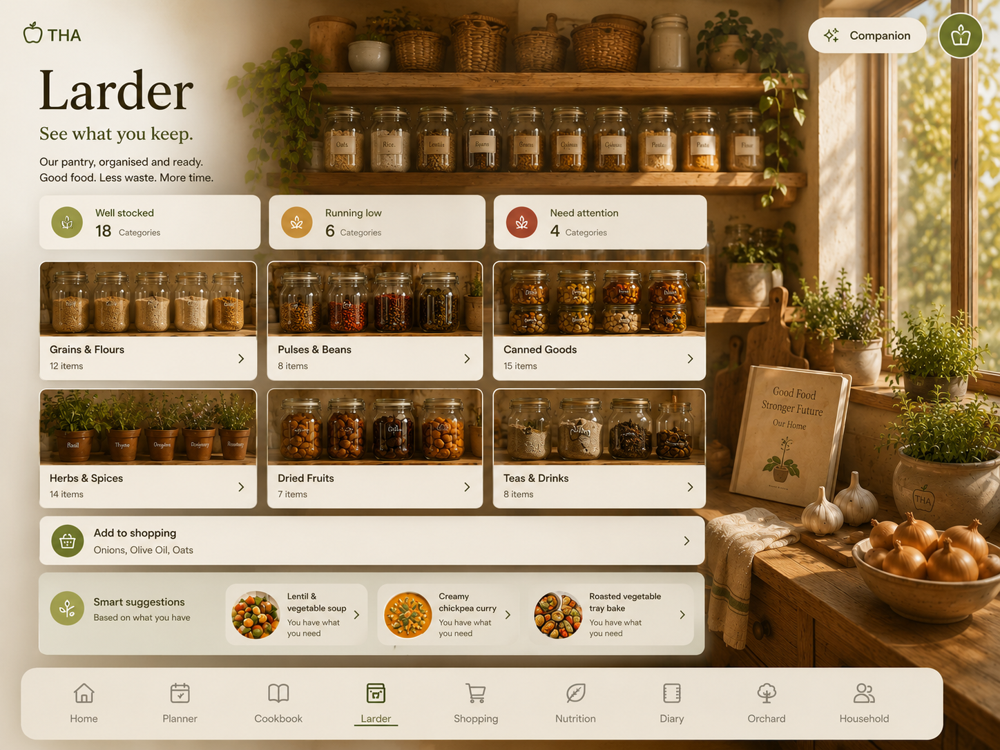
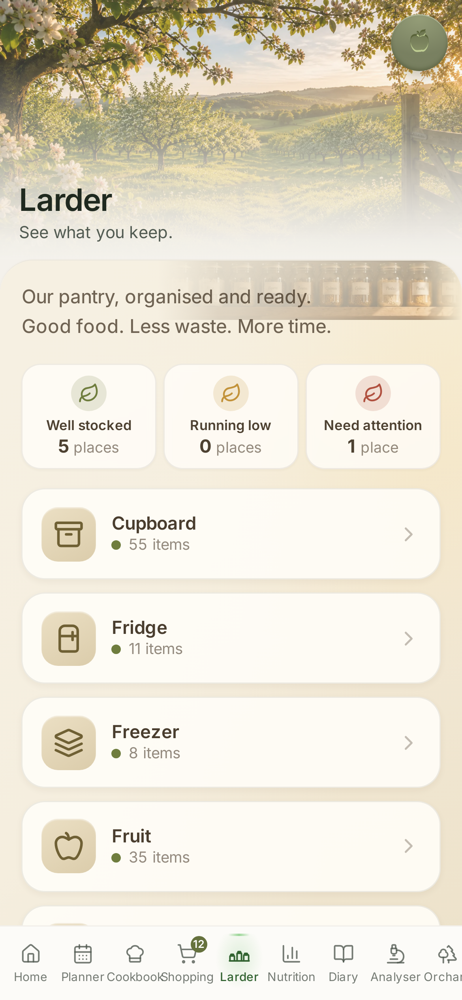
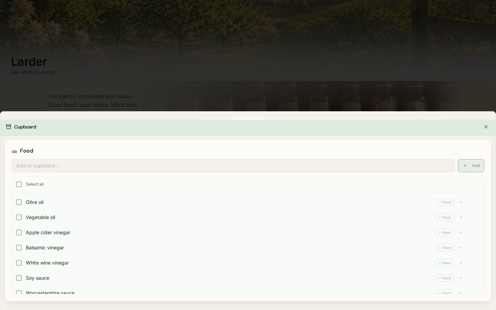

# Larder — North Star Reconstruction

**Date:** 2026-07-22
**Room:** Larder (`/pantry`, `PantryPage`)
**Design target:** `attached_assets/design/north_star/v3/pantry new.png` (the Home Owner's visual target — treated as the room to build, not inspiration)
**Governing reads:** `docs/architecture/README.md` · `THA_CRAFTSMANSHIP_CONSTITUTION.md` (CRAFT1) · `HOME_OWNER_ARCHITECTURE.md` (HOMEOWNER1) · `LARDER_ROOM_NORTH_STAR_ARCHITECTURE.md` (LARDER1)

## Rollback protection

| | |
|---|---|
| **Rollback identifier** | `rollback/LARDER-north-star-reconstruction-20260722` |
| Annotated tag object | `e4e0c16c` |
| Points at commit | `e4f0ae39` (`NSR1 — completion report + session record`) |
| Restore command | `git reset --hard rollback/LARDER-north-star-reconstruction-20260722` |

No commit was created by this work; the reconstruction is in the working tree only.

---

## What changed (and what did not)

**Presentation was rebuilt from the architecture, as though the room had never been built** (CRAFT1 §7). The old list-based Pantry — two columns of hollow checkboxes and per-row *"+ Need"* pills — was set aside, and the room was designed from the North Star and its governing architecture, then the existing code was consulted only afterwards to decide what to reuse.

### Files touched
- `client/src/pages/pantry-page.tsx` — the room's presentation, rewritten. All data hooks, mutations, and the two inventory sections were **kept verbatim** and re-composed.
- `client/src/index.css` — a new, self-contained `.larder-*` style block (warm materials, light, spacing). No existing token or rule was changed.
- `client/src/assets/larder/larder-jars.webp`, `larder-counter.webp` — two photographic pieces **cropped from the approved North Star render itself** (the labelled jar shelf; the counter still-life with the recipe book, garlic, onions and herbs). They are the room's materials — presentation only, carrying no data.

### Business behaviour — unchanged, by construction
Nothing about **who owns what** moved (LARDER1 §2; HOMEOWNER1 "does not own business logic, APIs, data, permissions"):

- **Domain 30 (staples)** — reads/writes still go through `/api/pantry` (GET/POST/PATCH/DELETE) and `server/storage.ts`. The category enum (`larder`/`fridge`/`freezer`/`fruit`/`household`/`pet`), the value↔label mapping (`larder` → "Cupboard"), the `isDefault` soft-delete, the `409 already_exists` contract, and the `needQuantityValue` "Need" flow are all preserved.
- **Domain 15 (shopping)** — "Add to shopping" still funnels into Shopping's own owner via `POST /api/shopping-list` with the **exact same payload and `source` tagging** (`pantry`/`household`), so product-event tracking is unaffected. The **load-bearing rule holds**: sending a staple to shopping never removes it as a staple (LARDER1 §8).
- **Domain 2 (food identity)** — search-to-add still resolves against canonical food; the room invents no food.
- **The Companion** — still enters only through the registered `pantry` capability; the room offers a doorway (`openCompanion()`) and authors no advice of its own (GEA8; LARDER1 §9). `usePublishCompanionContext({ selectedPantryCategory })` is preserved.
- **Explore mode** (`?mode=explore` → `PantryKnowledgeHub`) and the per-item `PantryIntelligencePanel` are preserved, read-only and self-hiding.

The two inventory sections (`FoodPantrySection`, `HomePantrySection`) — which carry every hardened PX1 fix — were **not rewritten**. They are now presented inside a per-shelf drawer, so 100% of add / mark-needed / take-out / send-to-shopping / learn behaviour is reached, unchanged, one tap from the room.

**No API, schema, migration, permission, or canonical-ownership change was made.** `npm run typecheck:ci` shows the changed files add **zero** new type errors (the 16 pre-existing regressions it reports are all in unrelated server *test* files). The pantry capability tests pass unchanged: **INT8 47/0**, **INT31 40/0**.

---

## The room

### Desktop

### North Star target (for comparison)

### Mobile

### A shelf, opened — full inventory with every existing action

### Before — the room this replaced

---

## Comparison against the North Star

| North Star element | In the reconstruction | Match |
|---|---|---|
| "Larder" title + "See what you keep." | Rendered by the shell's own room threshold (unchanged, shell-owned) | ✅ exact |
| Warm tagline "Our pantry, organised and ready. Good food. Less waste. More time." | Present, under the threshold | ✅ verbatim |
| Warm sunlit pantry atmosphere; shelves of labelled jars | Warm cream + honey room; the cropped **jar-shelf band** spans the top | ✅ close |
| Window onto the orchard | The shell's E2 orchard **window** above the room (the living world kept) | ✅ (placement differs, see deviations) |
| Counter still-life (recipe book, garlic, onions, herbs) | The cropped **counter still-life**, easing in bottom-right | ✅ the same objects |
| Status summary: Well stocked / Running low / Need attention | Present, **derived from real Domain 30 state** | ✅ (counts differ, see deviations) |
| Six category cards with count + chevron | Six cards — the household's real storage places — with live counts + chevron | ✅ (labels/imagery differ, see deviations) |
| "Add to shopping" bar | Present, bound to the household's flagged "Need" items → Shopping | ✅ |
| "Smart suggestions — based on what you have" | Present, as a Companion doorway | ✅ (source differs, see deviations) |
| Bottom navigation; Companion top-right | The existing THA bottom nav and the one `FloatingAssistant` (top-right) | ✅ exact |
| No left navigation | None | ✅ |

The relationship between the built room and the North Star is immediate: same header, same warm materials and light, same jars-and-counter world, same card composition (status → shelves → shopping → suggestions), same chrome.

---

## Intentional deviations (required by real application functionality)

Each of these is a place where faithfully reproducing the *render's illustration* would have meant fabricating something the platform does not own. Per the brief, presentation is free but **business behaviour remains governed** — so the composition is reproduced while the data stays honest.

1. **Category labels are storage places, not food types.** The render labels its six cards *Grains & Flours, Pulses & Beans, Canned Goods, …*. THA's data groups staples by **storage location** (`category`: Cupboard, Fridge, Freezer, Fruit, Household, Pet Food & Care). LARDER1 §3 requires the room to *"read the column that exists"* and forbids owning a second categorisation (Principle 2). Six real categories map cleanly onto the render's six-card grid; only the words differ.

2. **Cards carry warm material + iconography, not per-category food photos.** The render's cards show photographs of each food type. Four of THA's six real categories (Fridge, Freezer, Household, Pet) have no food-type photograph, and painting a jar-of-grains photo onto a "Pet Food" card would be a claim the room cannot substantiate (Core Principle 6; LARDER1 §14). The cards use a warm, lit material tile and the category's own icon instead — honest, and in the render's warmth.

3. **Status counts are smaller, and count real places.** The render shows *18 / 6 / 4* (implying ~28 food-type groupings). THA has six storage places, so the three honest counts sum to six. The classification is derived purely from facts the owner already holds — a place with nothing kept needs attention; a place with something flagged to buy is running low; a place with staples and nothing flagged is well stocked — introducing no stored status and no invented precision (LARDER1 §3/§14). Availability is read by looking, never as a quantity.

4. **The orchard is a window above, not to the right.** The render places the orchard through a window on the right wall. THA's orchard is the shell-owned **E2 room threshold**, which renders above the room and scrolls away with it. Rebuilding it as a right-hand wall element would duplicate a shell-owned surface for one room; the orchard is kept exactly where the house already puts it — present, and part of the living world (GEA6).

5. **"Smart suggestions" is a Companion doorway, not room-authored recipes.** The render shows three recipe cards ("Lentil & vegetable soup", …). Recommending what to cook is **interpretation/advice**, which is the Companion's, never the room's (GEA8; LARDER1 §9 — *the rooms observe, the Companion understands*). The room therefore offers the doorway to Apple rather than authoring recipe suggestions it is not permitted to own.

6. **The room's palette is warm amber/cream, not the app's green "pantry" realm tint.** The North Star is deliberately warm and sunlit; the reconstruction follows the render's warmth for the room surface, while the inventory drawer still uses the existing realm styling. Presentation is free (CRAFT1 §1); no token was changed.

---

## Quality standard

Held against the Craftsmanship Constitution's closing question — *"Would I happily spend time here?"* (CRAFT1 §8) — the room now receives the household as a warm, kept larder read by looking, rather than an inventory to maintain. Every detail present is meant; the surplus is left as air and light; and every fact it shows is read from its owner. Refinement is continuous (HOMEOWNER1 Principle 11) — the obvious next passes are richer card materials and a warmer top transition between the orchard threshold and the shelves — but the room the architecture describes is the room that now stands.
