# Room Screenshot Baseline — The Healthy Apples

**Purpose.** A complete visual baseline of the current THA application, one screenshot
per major user-facing room, captured so the Home Owner can review the whole house
before the next reconstruction phase.

This document is **descriptive only** — it records what each room looks like today. It
does not critique, score, or propose changes.

---

## Capture conditions

| Item | Value |
|---|---|
| Date captured | 2026-07-22 |
| Branch | `int1-intelligence-platform` |
| App URL | `http://localhost:5000` (local dev server, `npm run dev`) |
| Session | Demo household (`/api/demo/start`) — seeded with sample meals, pantry, shopping and plan data |
| Desktop viewport | 1440 × 900 CSS px, device scale factor 2 → **2880 px-wide** PNGs |
| Mobile viewport | 390 × 844 CSS px, device scale factor 3 (iPhone-class) |
| Browser | Headless Chromium (Playwright) |
| Dev chrome | The demo "Preview" trial banner and Replit dev banners were hidden via injected CSS for a clean baseline. The fixed bottom navigation was hidden **only** in the tall full-page room shots (it is captured in its own place in shots 15 & 16). |
| Screenshot mode | Full-page (whole scrollable room) for rooms; viewport for the Companion and navigation shots |

**Screenshot folder:** `docs/implementation/screenshots/`
**This report:** `docs/implementation/ROOM_SCREENSHOT_BASELINE.md`

> Note on room names: this report uses the room names from the brief. Where the app's
> own label differs, both are given (e.g. **Profile → "Household"**, **Community →
> "Orchard"**). These are naming differences, recorded as observations, not judgements.

---

## 1. Welcome Home

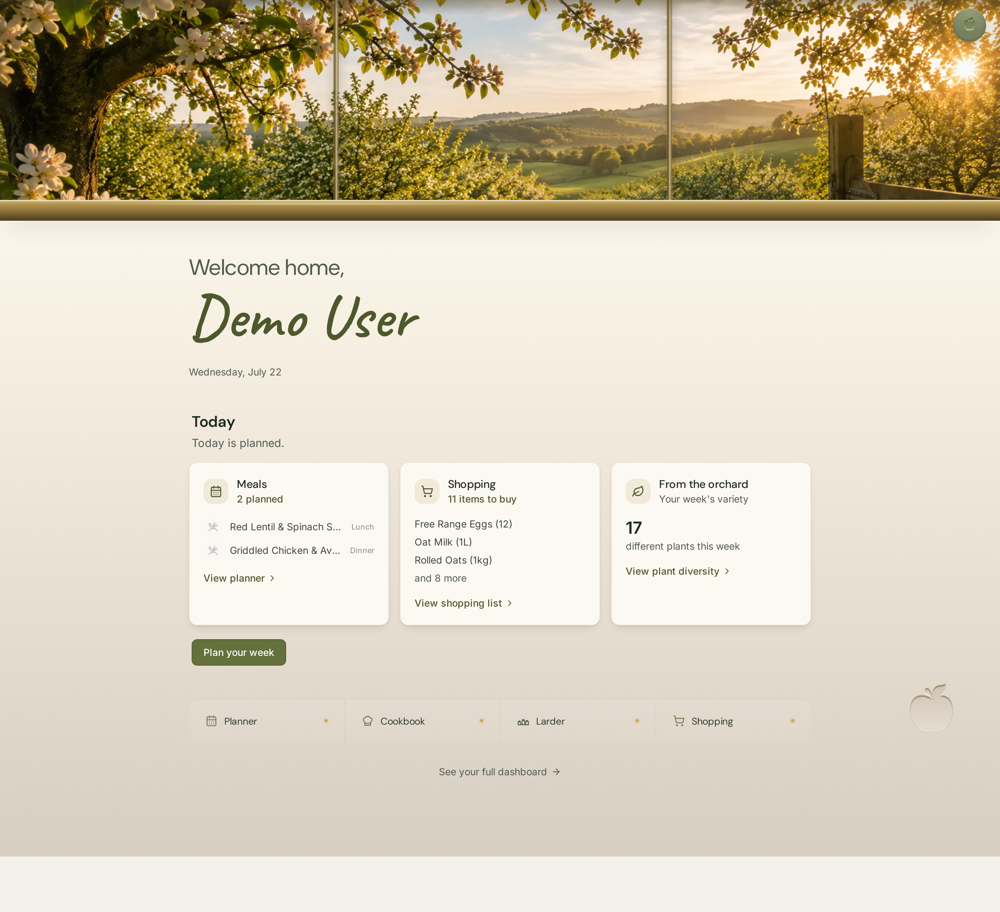

- **Route:** `/home` (`HomeExperiencePage`)
- **Status:** Implemented · populated
- **Notes:** Standing welcome with an orchard-window hero, "Welcome home, Demo User",
  today's date, and a "Today" summary with three cards — Meals (2 planned), Shopping
  (11 items to buy) and From the orchard (17 different plants this week). The closed
  Companion launcher (apple) sits top-right.
- **Observations:** None of note; the room is fully composed.

---

## 2. Kitchen / Cookbook

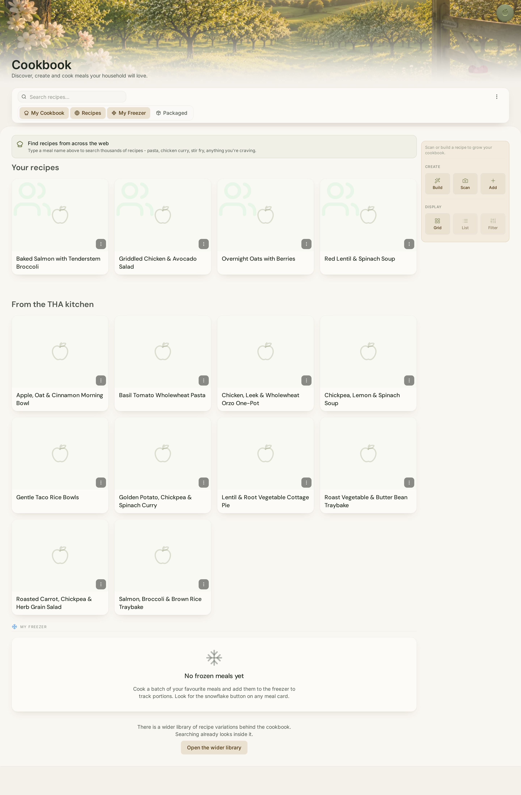

- **Route:** `/cookbook` (`MealsPage`; `/meals` is the same page)
- **Status:** Implemented · populated
- **Notes:** "Cookbook — Discover, create and cook meals your household will love."
  Tabs: My Cookbook / Recipes / My Freezer / Packaged. Search bar with a "find recipes
  from across the web" prompt. Populated recipe grid (Baked Salmon, Griddled Chicken &
  Avocado Salad, Overnight Oats, Red Lentil & Spinach Soup, and a "From the THA Kitchen"
  set). A right-hand rail offers Build / Scan / Add and Grid / List / Filter.
  "My Freezer" shows its empty state ("No frozen meals yet").
- **Observations:** Recipe cards use placeholder apple / silhouette icons rather than
  photography (populated with data, but imageless).

---

## 3. Larder

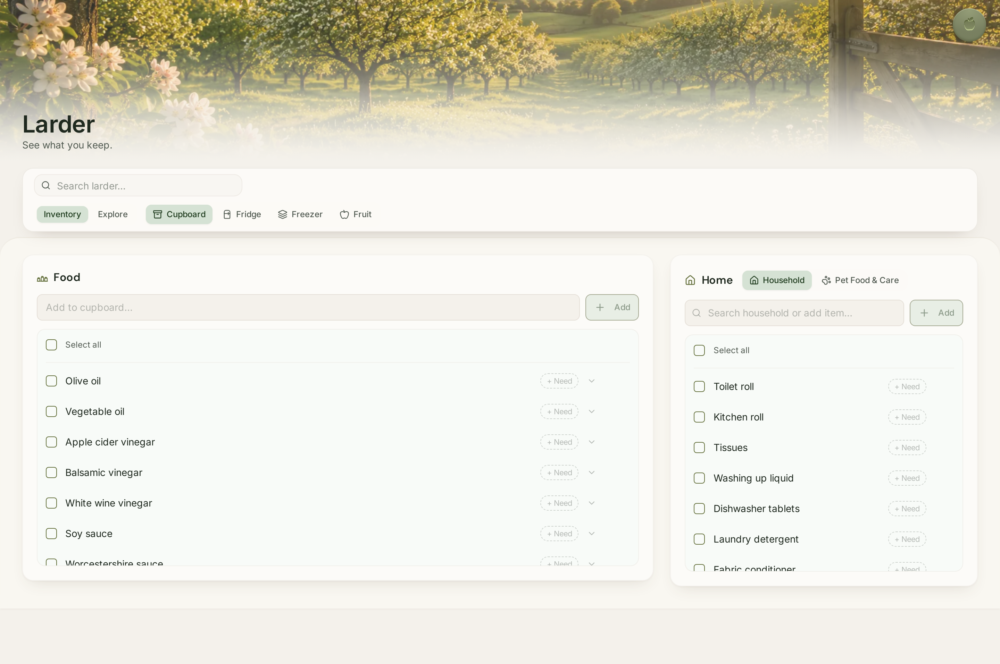

- **Route:** `/pantry` (`PantryPage`)
- **Status:** Implemented · populated
- **Notes:** "Larder — See what you keep." Tabs: Inventory / Explore, and location
  filters Cupboard / Fridge / Freezer / Fruit. Two columns — **Food** (olive oil,
  vinegars, soy sauce, …) and **Home** (Household / Pet Food & Care: toilet roll,
  kitchen roll, washing-up liquid, …). Each item has a "+ Need" action.
- **Observations:** None of note.

---

## 4. Planner

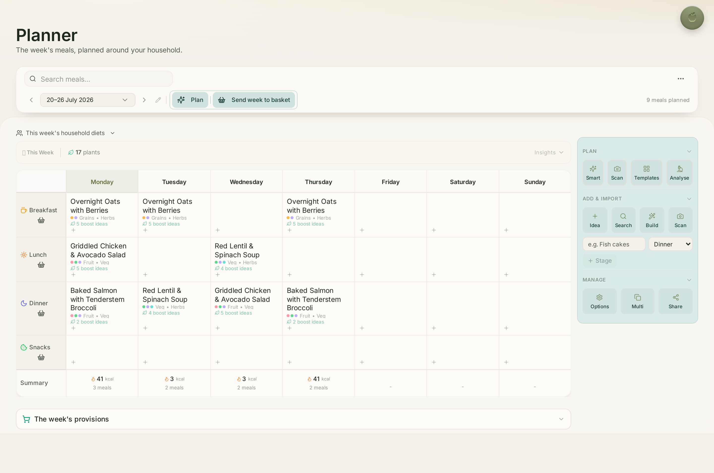

- **Route:** `/planner` (`WeeklyPlannerPage`; `/weekly-planner` is the same page)
- **Status:** Implemented · populated
- **Notes:** "Planner — The week's meals, planned around your household." Week selector
  (20–26 July 2026), "9 meals planned", Plan / Send week to basket actions. Full 7-day ×
  Breakfast/Lunch/Dinner/Snacks grid with meals placed and "boost ideas" hints, a daily
  Summary row (kcal / meals), and a right-hand action rail (Plan / Add & Import / Manage).
  "The week's provisions" section sits below.
- **Observations:** Some Summary kcal figures read very low (e.g. "3 kcal") — recorded
  as an observation only.

---

## 5. Shopping

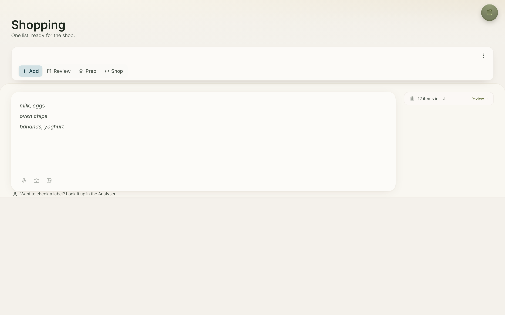

- **Route:** `/shopping-workspace` (`ShoppingWorkspacePage`; `/list`, `/shopping-list`,
  `/basket`, `/analyse-basket` all redirect here)
- **Status:** Implemented · populated (list held behind the Review tab)
- **Notes:** "Shopping — One list, ready for the shop." Four modes: **Add** / Review /
  Prep / Shop. The room opens on **Add**, a free-text capture box (example text "milk,
  eggs / oven chips / bananas, yoghurt") with voice, camera and image-upload inputs.
  A side card shows "12 items in list" with a Review link.
- **Observations:** The default landing view is the empty capture box; the populated
  list (12 items) lives one tab across, under **Review**.

---

## 6. Nutrition

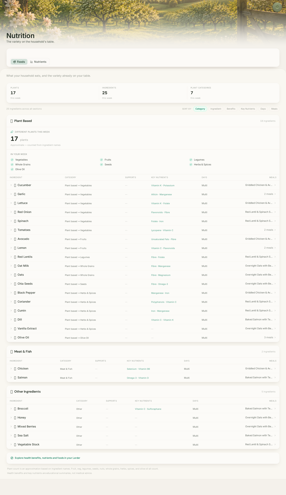

- **Route:** `/nutrition` (`PlantDiversityPage`; `/plant-diversity` redirects here)
- **Status:** Implemented · populated
- **Notes:** "Nutrition — The variety on the household's table." Tabs Foods / Nutrients.
  Headline stats (17 plants, 25 ingredients, 7 plant categories this week). A full
  ingredient table grouped by Plant Based / Meat & Fish / Other, each row showing
  category, key nutrients, days and the meals it appears in.
- **Observations:** None of note.

---

## 7. Diary

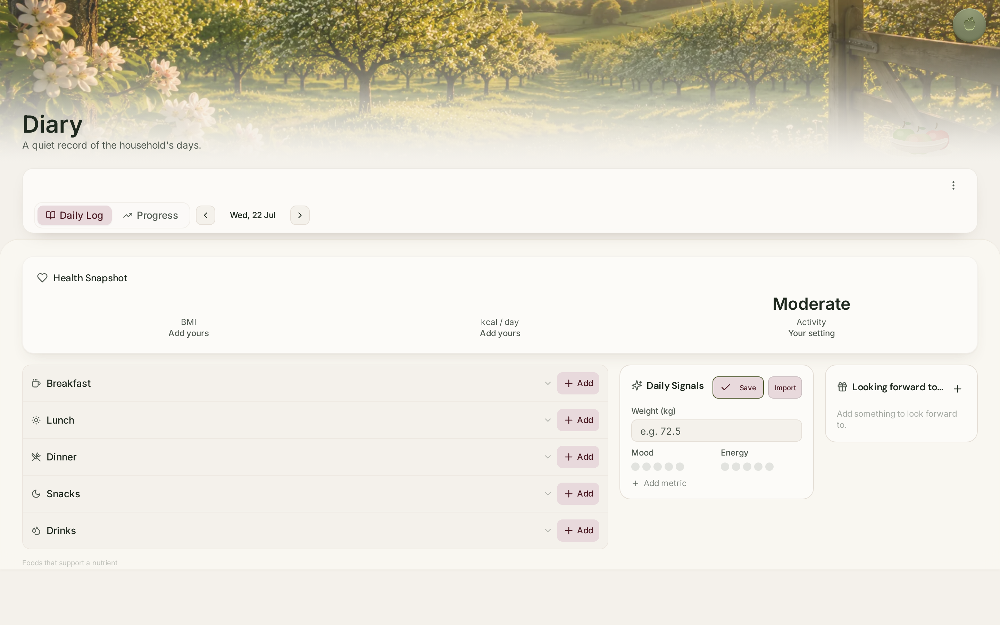

- **Route:** `/diary` (`FoodDiaryPage`; `/my-diary` is the same page)
- **Status:** Implemented · mixed (structure populated, day is empty)
- **Notes:** "Diary — A quiet record of the household's days." Tabs Daily Log / Progress,
  date stepper (Wed, 22 Jul). Health Snapshot (BMI / kcal per day / Activity — the first
  two show "Add yours" placeholders, Activity = Moderate). Meal sections
  (Breakfast / Lunch / Dinner / Snacks / Drinks) each with an Add action, plus a Daily
  Signals card (weight, mood, energy) and a "Looking forward to…" card.
- **Observations:** A natural **empty state** — the demo day has no logged entries yet;
  BMI and kcal are unset.

---

## 8. Companion (closed)

- **Surface:** `FloatingAssistant` launcher, present on every authenticated page
- **Status:** Implemented
- **Notes:** In its resting state the Companion is a single apple button pinned
  top-right. Captured over the Welcome Home room.
- **Observations:** None of note.

---

## 9. Companion (open)

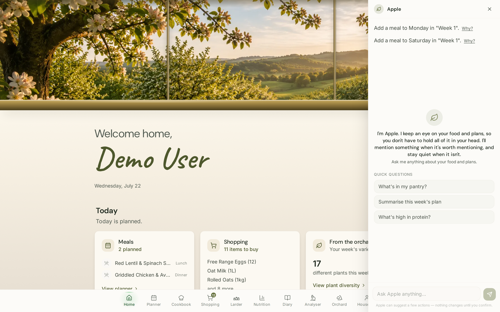

- **Surface:** `FloatingAssistant` expanded panel ("Apple")
- **Status:** Implemented · populated
- **Notes:** Opening the launcher slides in a right-hand panel titled "Apple". It shows
  suggested actions ("Add a meal to Monday in 'Week 1'", each with a "Why?"), a short
  self-introduction, Quick Questions ("What's in my pantry?", "Summarise this week's
  plan", "What's high in protein?"), an "Ask Apple anything…" input, and the footer
  "Apple can suggest a few actions — nothing changes until you confirm."
- **Observations:** None of note.

---

## 10. Profile

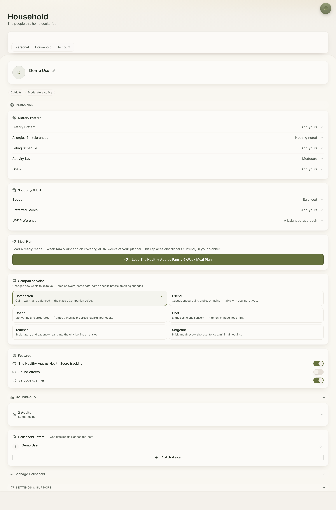

- **Route:** `/profile` (`ProfilePage`)
- **Status:** Implemented · populated
- **Notes:** The page is titled **"Household — The people this home cooks for."** Tabs
  Personal / Household / Account. Sections include Dietary Pattern, Allergies &
  Intolerances, Eating Schedule, Activity Level, Goals; Shopping & UPF (Budget, Preferred
  Stores, UPF Preference); a "Load the 6-week family meal plan" action; **Companion
  voice** selector (Companion / Friend / Coach / Chef / Teacher / Sergeant); Features
  toggles (Health Score, Sound effects, Barcode scanner); Household eaters; and
  Settings & Support.
- **Observations:** The requested "Profile" room is labelled **"Household"** in both the
  page heading and the bottom-nav item. Several personal fields show "Add yours" / "Nothing
  noted" placeholders (demo defaults).

---

## 11. Community

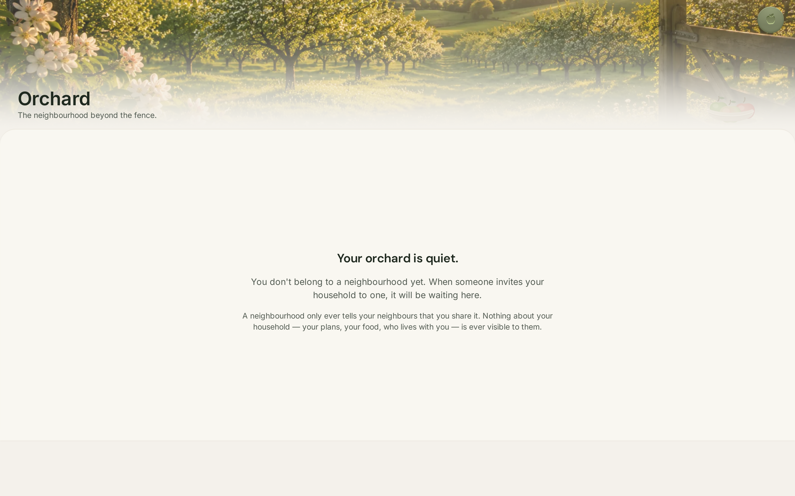

- **Route:** `/orchard` (`OrchardPage`)
- **Status:** Implemented · empty state
- **Notes:** "Orchard — The neighbourhood beyond the fence." The demo household is not in
  a neighbourhood, so the room shows its empty state: "Your orchard is quiet… When someone
  invites your household to one, it will be waiting here," with a privacy reassurance.
- **Observations:** The requested "Community" room is labelled **"Orchard"**. Captured in
  its empty (no-neighbourhood) state.

---

## 12. Partners

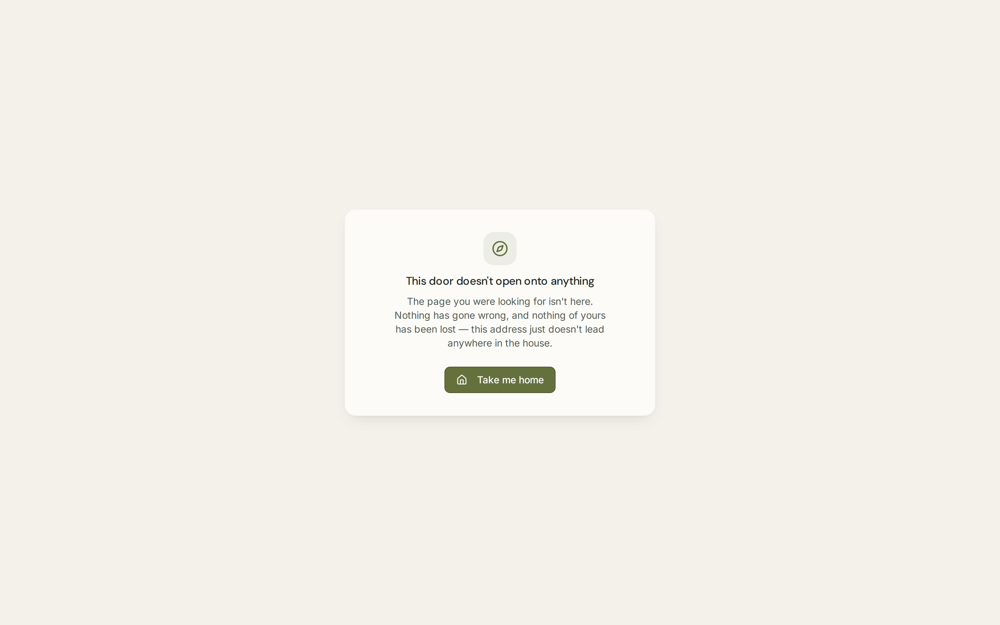

- **Route:** `/partners` — **withdrawn** (PROD2)
- **Status:** Deliberately closed (not currently a live room)
- **Notes:** The `/partners` route is intentionally withdrawn. All partner entries were
  placeholder businesses on `example.com`, so per the product's trust principles the door
  was closed rather than left ajar. The page, its data file and its types remain on disk
  and out of the bundle; the route is set to return the moment real partners exist. Visiting
  `/partners` today lands on the house's not-found card: **"This door doesn't open onto
  anything."**
- **Observations:** Not a defect — this is the documented, intended state. Captured for
  completeness.

---

## 13. Support

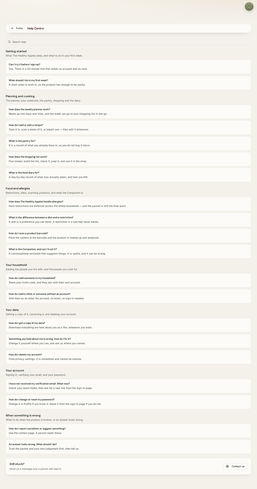

- **Route:** `/help` (`HelpCentrePage`), reached from Profile → Settings & Support
- **Status:** Implemented · populated
- **Notes:** "Help Centre" with a search box and full FAQ, grouped under Getting started,
  Planning and cooking, Food and allergies, Your household, Your data, Your account, and
  "When something is wrong". A "Still stuck? … Contact us" panel closes the page.
- **Observations:** Support is not a bottom-nav destination; it is reached via Profile.
  (A related `/contact` page also exists.)

---

## 14. Administration

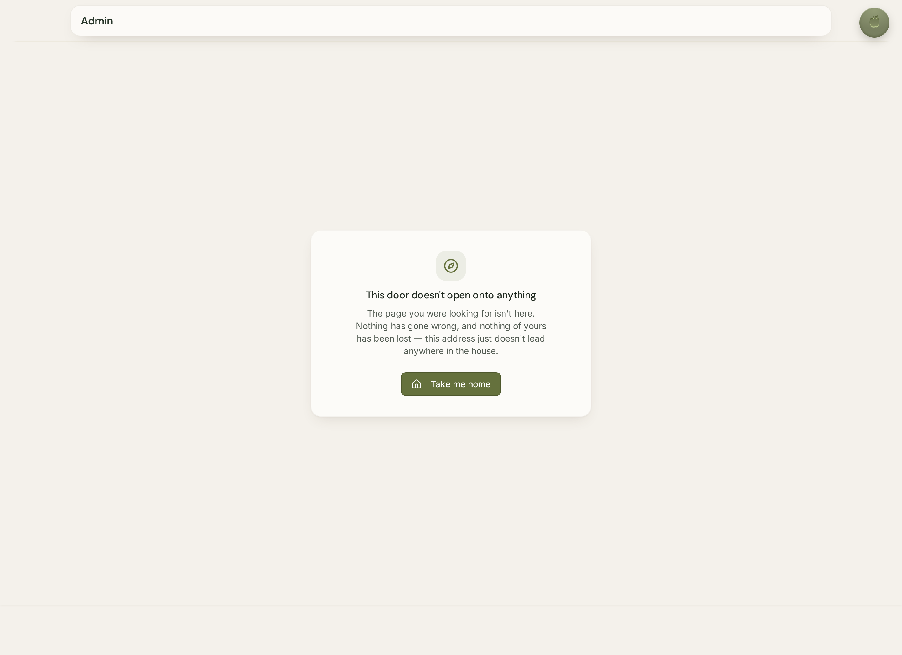

- **Route:** `/admin` (`AdminPage`, wrapped in the shared Admin banner)
- **Status:** Implemented · **privilege-gated** (not visible to the demo household)
- **Notes:** The Admin domain has a full set of surfaces (Users, Ingredient/Products,
  Recipe Sources, Companion Intelligence, Intelligence, Benchmark Households, Development
  World, Observations, Behaviour, Knowledge Review/Claims, Canonical Publication
  Integrity). The demo (non-admin) session renders the Admin **banner chrome** but the
  content resolves to the "This door doesn't open onto anything" card — admin content is
  gated behind an admin role.
- **Observations:** Full Administration content **could not be captured** from a demo
  session because it requires an admin account. What is shown is the gated state: admin
  header + not-found body.

---

## Navigation

### Desktop navigation

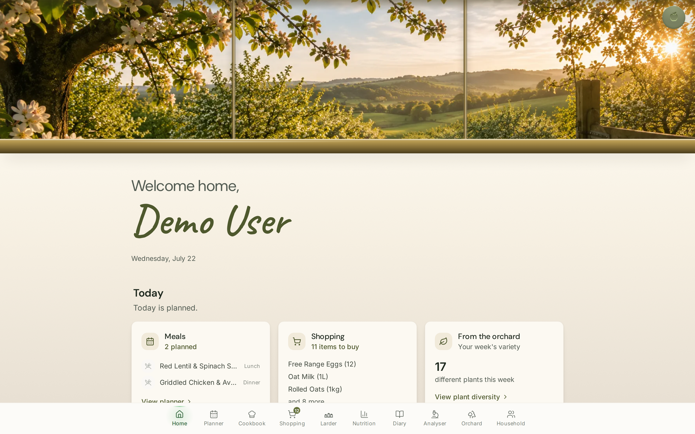

- **Status:** Implemented
- **Notes:** A fixed bottom tab bar carries the primary rooms: **Home · Planner ·
  Cookbook · Shopping · Larder · Nutrition · Diary · Analyser · Orchard · Household**
  (Shopping shows a "12" badge). The apple menu (top-right) opens Profile/Admin/etc.; at
  large widths a left sidebar is also available.

### Mobile navigation

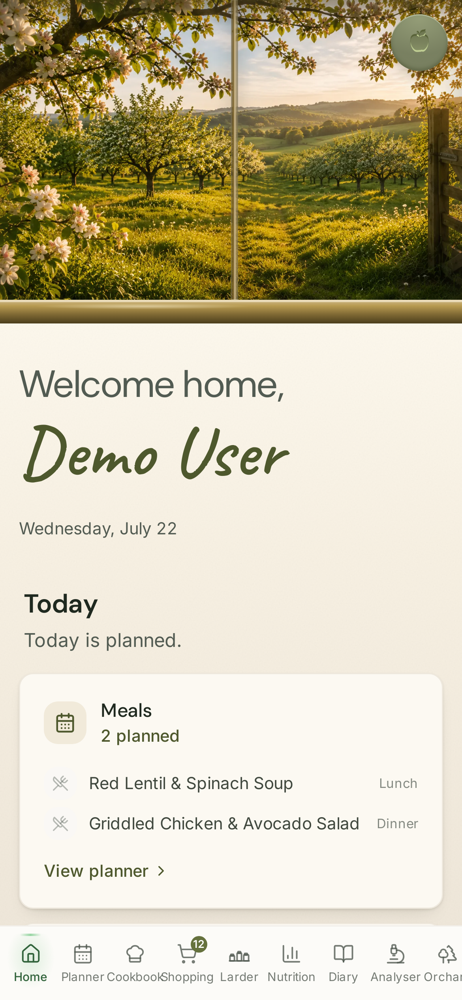

- **Status:** Implemented
- **Notes:** At phone width the same bottom tab bar appears and scrolls horizontally to
  reach the later tabs (Analyser, Orchard, Household). Home content stacks into a single
  column.

---

## Rooms captured vs. requested

| # | Requested room | App label | Route | Captured | State |
|---|---|---|---|---|---|
| 1 | Welcome Home | Home | `/home` | ✅ | Populated |
| 2 | Kitchen / Cookbook | Cookbook | `/cookbook` | ✅ | Populated |
| 3 | Larder | Larder | `/pantry` | ✅ | Populated |
| 4 | Planner | Planner | `/planner` | ✅ | Populated |
| 5 | Shopping | Shopping | `/shopping-workspace` | ✅ | Populated (via Review) |
| 6 | Nutrition | Nutrition | `/nutrition` | ✅ | Populated |
| 7 | Diary | Diary | `/diary` | ✅ | Empty day |
| 8 | Companion (closed) | Apple | overlay | ✅ | — |
| 9 | Companion (open) | Apple | overlay | ✅ | Populated |
| 10 | Profile | Household | `/profile` | ✅ | Populated |
| 11 | Community | Orchard | `/orchard` | ✅ | Empty state |
| 12 | Partners | — (withdrawn) | `/partners` | ⚠️ | Withdrawn (not-found door) |
| 13 | Support | Help Centre | `/help` | ✅ | Populated |
| 14 | Administration | Admin | `/admin` | ⚠️ | Gated (needs admin role) |
| + | Desktop navigation | — | — | ✅ | — |
| + | Mobile navigation | — | — | ✅ | — |

---

## Pages that could not be fully captured

- **Partners (`/partners`)** — intentionally withdrawn; only the not-found "door" can be
  shown. This is the documented intended state, not a fault.
- **Administration (`/admin`)** — full admin content requires an admin account. The demo
  session used for this baseline is not an admin, so only the gated state (admin banner +
  not-found body) was captured. Re-running from an admin login would capture the admin
  surfaces.

## Runtime errors encountered

- No blocking runtime or page errors were observed. Every room rendered fully.
- The only console message of note was a benign `401 Unauthorized` on `GET /api/user`
  during the very first page load, before the demo session was established — expected
  behaviour for the unauthenticated landing request.

---

## Observations gathered across the house (neutral, for the Home Owner's review)

These are recorded as factual observations to support the review, not as critiques:

1. **Room name vs. brief:** Profile is presented as "Household"; Community as "Orchard";
   Kitchen/Cookbook as "Cookbook".
2. **Not every requested room is a bottom-nav destination:** Profile appears as
   "Household"; Support is reached via Profile; Partners is withdrawn; Administration is
   behind the apple menu and an admin role. The bottom nav also surfaces an **Analyser**
   room not in the requested list.
3. **Cookbook cards are imageless** (placeholder apple/silhouette icons).
4. **Admin shows a not-found body under an "Admin" header** for non-admin sessions — a
   chrome/content mismatch that reflects the gating, seen from a demo login.
5. **Some Planner daily-summary kcal values read implausibly low** (e.g. "3 kcal").
