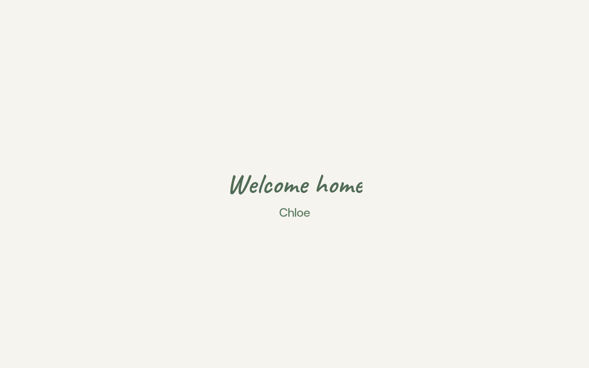
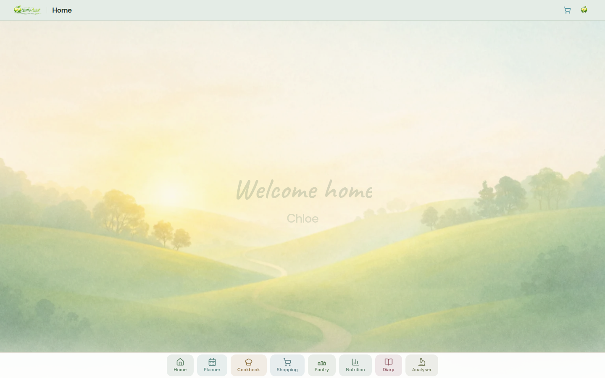
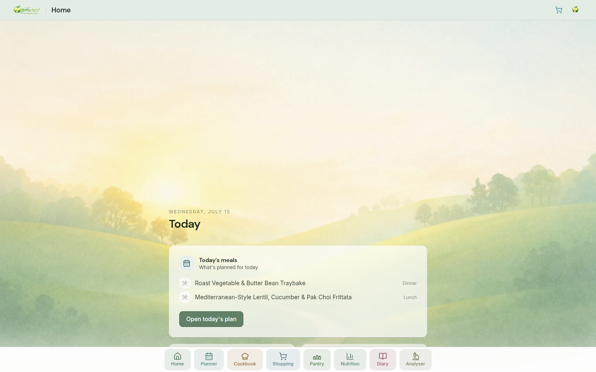
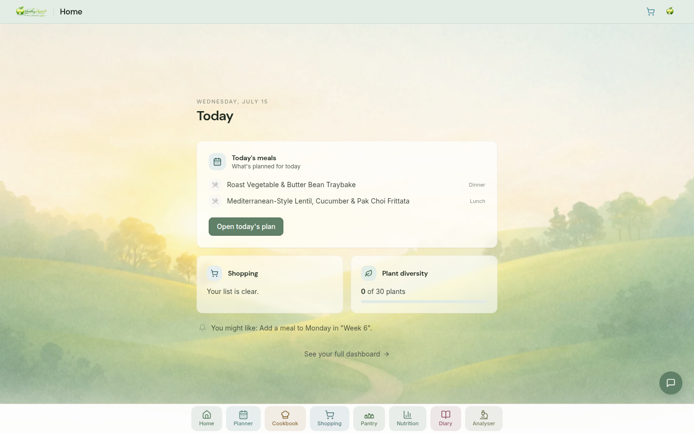
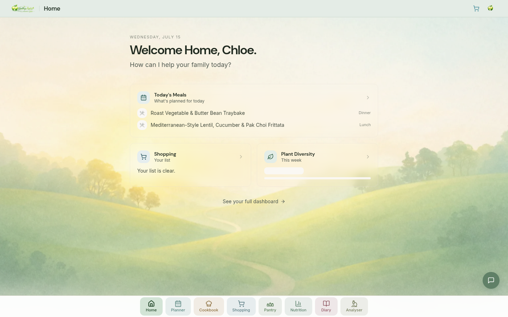
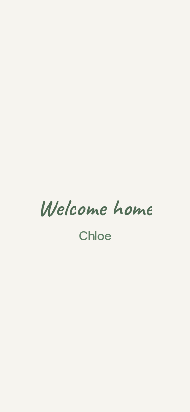
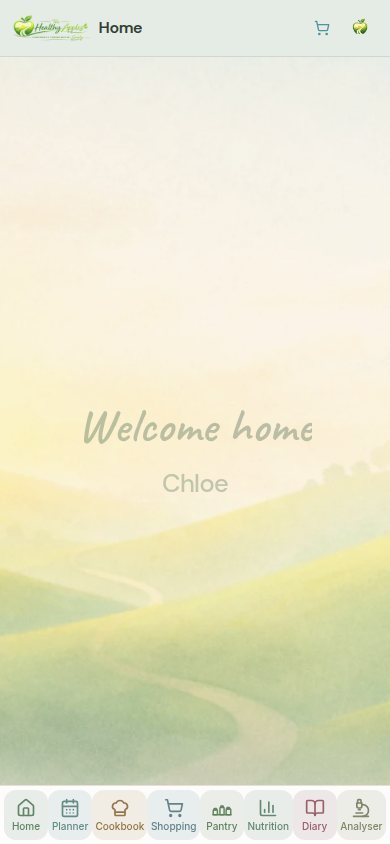
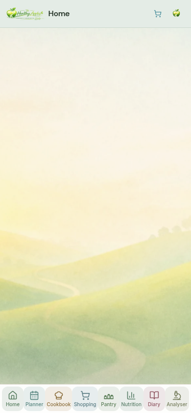
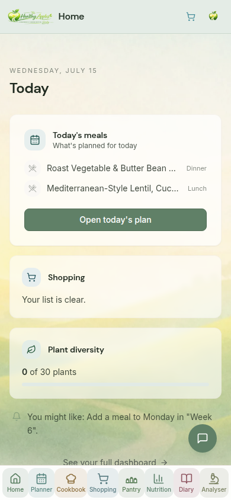
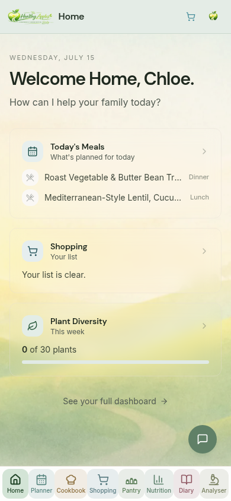

# UX — The Arrival Experience (development-only prototype)

**Workstream:** `ARRIVAL1_Arrival_Experience_Prototype`
**Date:** 2026-07-15 · refined 2026-07-15
**Rollback:** `rollback/ARRIVAL1-arrival-experience-prototype-20260715` → `3176c62d`
**Refinement rollback:** `rollback/ARRIVAL1-refine-welcome-header-sheen-20260715` → `3176c62d`
**Status:** Prototype delivered — **pending a look, and a decision** (ADOPT / REJECT).
**Route:** `/dev/arrival` — `import.meta.env.DEV` only. Absent from every production bundle.

> **Refinement (2026-07-15).** Four calms to the same arrival, no new components,
> live Home still untouched: (1) the welcome now **lingers** — "Welcome home" and
> the name are held fully readable through a real beat before anything moves, and
> then **fade slowly** as the orchard becomes dominant rather than cutting away;
> (2) the greeting is a **deep THA green** (the palette's deep-primary token), not
> the near-black `--foreground` it was; (3) the header is confirmed **byte-identical**
> to the live Home's (`WorkspaceHeader realm="home" title="Home" wide`), verified
> against the live page on desktop and mobile; (4) once the canonical header and
> long logo have settled, **one soft sunrise sheen** passes left-to-right across
> the logo — masked to the mark itself, played exactly once, and never mounted for
> reduced-motion or a returning visitor.

> This is an **experience prototype**. It does not modify the live Home
> (`home-experience-page.tsx`, `/home`), which is untouched and does not import a
> line of this work. It exists to answer one question by letting you *look* rather
> than imagine: **should The Healthy Apples begin with an arrival before it becomes
> a workspace?**

---

## 1. What this replaces, and why

It replaces **UXHOME1** (`/dev/home-arrival`, `home-arrival-prototype.tsx`), which
has been **discarded** — file, route, capture script and report all deleted.

UXHOME1 answered a narrower question: *how should the Home page itself feel on
arrival?* Its answer was to **animate the Home page** — the cards revealed in a
staged sequence, the signature wrote itself over them. It was well-made, but it
was still a page that performed as it loaded.

ARRIVAL1 asks a different question: *what if you did not arrive at a page at all,
but at a **place**?* The distinction is the whole point of this prototype. You are
not shown a dashboard that animates in. You **walk in** — through a calm cream
field, past a quiet hello and the orchard settling into view, and then a single
gentle glide sets you down inside an ordinary, still workspace. The arrival is the
experience; the workspace is simply where you land.

**What was kept** (because it has value independent of either prototype, and the
arrival reuses it): the Companion `withheld` channel (`companion-context.tsx`), the
signature type role and token (`--font-signature` / `.text-signature` /
`.signature-ink` in `index.css`), and the **UIA §8 amendment** that admitted the
signature voice. None of that is prototype-specific; all of it is governed.

---

## 2. The sequence

| # | Moment | Fires at | What happens | How it is done |
|---|---|---|---|---|
| 1 | **Cream** | 0s | A calm cream field. Nothing else visible. | A `bg-background` scrim (`fixed inset-0`) laid over the shared orchard backdrop AND the header, at full opacity. |
| 2 | **Hello** | 0.6s / 1.5s | "Welcome home" in an elegant hand; the household's name settles beneath it. Both in a **deep THA green**, allowed to breathe. | `.text-signature` + `.signature-ink` (the writing-reveal) coloured `var(--primary-border)` for the greeting; `font-display` `text-primary` for the name — *their* name is not ours to restyle in shape, only to tint on-brand. |
| 3 | **The hold** | 1.5 → 4.5s | The greeting stays whole and **fully readable** — a real beat to notice and read it, not a glimpse. | Nothing moves. The welcome section holds `opacity: 1` for ~3s after the words settle. |
| 4 | **The orchard emerges** | 3.9s (1.8s) | The cream lifts and the orchard is simply there. No zoom. No parallax. No focus pull. | The scrim's opacity animates `1 → 0` over 1.8s. It ends at nothing, so the scene resolves to exactly the backdrop every other page shows. |
| 5 | **The greeting recedes** | 4.5s (1.7s) | As the orchard becomes dominant, the greeting **fades slowly out** — it recedes, it never blinks away. | The welcome section's own `opacity 1 → 0` over 1.7s, easing `[0.4,0,0.2,1]`, beginning only after the read. |
| 6 | **The standard header** | (from frame 1) | The normal THA page header — not a bespoke one — is in place, exactly as throughout the app. | `WorkspaceHeader realm="home" title="Home" wide` — the **identical line** the live Home uses. Portaled to the shared top slot, mounted from the first frame and hidden under the cream, so when the cream lifts it is already there and *nothing reflows*. |
| 7 | **The sunrise sheen** | 6.0s (1.15s) | One soft left-to-right light crosses the long THA logo, like morning sun catching the mark — then it is gone. | A `fixed` overlay pinned to the logo's live box and **masked to the logo** (`mask-image: /logo-long.png`); a warm near-white band (`screen` blend, ~12° tilt) sweeps across **once**. It never touches or forks `WorkspaceHeader`. Reduced-motion / return never mount it. |
| 8 | **Arriving** | 6.8s (1.7s) | A single, slow downward glide carries the viewport from the welcome scene into the workspace. "I've arrived." | A one-time, self-easing scroll of the shell's own scroll container (`easeOutCubic`, 1.7s). It **yields instantly** if the household scrolls, wheels or taps — and never starts if they already have. |
| 9 | **The Companion** | on settle | Appears naturally once the workspace is reached. Present, not demanding. | The one `FloatingAssistant`. The page only asks it to hold its entrance (`useWithholdCompanion`) until `settled`, then hands the invitation back. It is **never animated** by this page. |

> **Timing values used** (`T`, seconds): `signature 0.6` · `name 1.5` · greeting held to
> `4.5` · `orchard 3.9` (`orchardDur 1.8`) · `greetingFade 4.5` (`greetingFadeDur 1.7`) ·
> `sheen 6.0` (`sheenDur 1.15`) · `drift 6.8` (`driftDur 1.7s`). Every surface is
> interactive from the first frame throughout — these are choreography, not a queue.

### The workspace you land in

One viewport. No scrolling for normal daily use. Only what matters, in one clear
hierarchy:

- **Today's meals** — the primary, and the home of the one primary action.
- **Shopping** and **Plant diversity** — one supporting beat, visibly subordinate.
- **One household reminder** — a single sentence (the Behaviour Engine's, verbatim), never a feed.
- **One obvious primary action** — *"Open today's plan"* / *"Plan today"*, its label following the truth of today.
- A quiet way deeper (*"See your full dashboard"*) that never competes.

Design: softer foreground surfaces (`bg-card/60–70` + `backdrop-blur-sm`, thinner
`border-border/30`), more air, fewer competing elements, stronger hierarchy. It is
meant to feel expensive without looking expensive.

---

## 3. What it explicitly is **not**

Held against the brief's DO-NOT list:

- **Not a splash screen.** Everything is in the DOM and interactive from the first
  frame; nothing is gated behind the sequence. The whole workspace is usable before
  the hand has finished writing.
- **Not onboarding, and no unnecessary delay.** The full arrival is shown **once per
  session** (`sessionStorage`); a return within the session, and every reduced-motion
  visit, goes straight to the still workspace. A welcome you cannot get past is a toll.
- **No theatrical animation, no parallax, no scroll-jacking.** The only motions are
  an opacity fade (the cream lifting) and a single easing scroll that the user owns.
  Nothing bounces; nothing captures the wheel; no component animates independently.
- **The dashboard content is not redesigned** — it reads the same data, from the same
  query keys, through the same canonical components as the live Home.

### Accessibility & honesty

- **Reduced motion is a guarantee, not a variant.** `prefers-reduced-motion` yields
  the finished workspace immediately — no cream, no writing, no glide, **and no
  sheen**: the completed long logo is simply present. It is the *absence* of an
  arrival, which is the only honest response to that preference.
- **The greeting colour clears AA.** The deep THA green (`--primary-border`,
  `hsl(132 14% 37%)` light / `44%` dark) sits on the cream field at ≈5.8:1 and on
  the dark background at ≈3.8:1 — both above the WCAG AA bar for large text — so the
  softer tone is a legibility improvement, not a trade against it. It is a colour
  THA already owns; no new value was introduced.
- **The sheen carries no information and blocks nothing.** It is `aria-hidden`,
  `pointer-events-none`, and masked to a decorative mark; the logo underneath stays
  a live link throughout, and a screen reader never learns the light happened.
- The greeting is real, selectable, translatable text from the first frame; a screen
  reader hears one ordinary sentence and never learns two typefaces were involved.
- The signature **webfont is not loaded in production**. Only this dev-only page
  fetches Caveat; the token resolves, but no household downloads a font for a page
  they cannot reach.

---

## 4. Evidence

Screenshots and a screen recording of the complete sequence
(`npx tsx scripts/capture-arrival-experience.ts`, zero-write, dev-world household).
The sheen close-ups come from `scripts/capture-arrival-sheen-closeup.ts`, which also
**asserts** the overlay is masked to `/logo-long.png` and pinned to the visible
logo's box (desktop `67×24` and mobile `79×28` — both aligned to the pixel):

**Desktop (1440×900)** — welcome (deep-green greeting, held) → emerging (greeting receding as the orchard takes over) → sheen → workspace

| Welcome | Emerging | Sunrise sheen | Workspace |
|---|---|---|---|
|  |  |  |  |

| Sheen close-up (2× — the light on the mark) | Reduced motion (no arrival, no sheen) | Live Home — the control, unchanged |
|---|---|---|
|  |  |  |

**Mobile (390×844)**

| Welcome | Emerging | Sunrise sheen | Workspace |
|---|---|---|---|
|  |  |  |  |

| Sheen close-up (2×) | Reduced motion | Live Home — control |
|---|---|---|
|  |  |  |

**Recording of the full arrival** (cream → hello → orchard → header → glide → workspace):

| Desktop | Mobile |
|---|---|
|  |  |

Source `.webm` (smaller, higher quality) sit beside the GIFs in
`docs/ui-audit/arrival-experience/video/`.

> _Capture is zero-write: it logs in as a fictional DEV-only Development World
> household, reads, and photographs — no account created, no data mutated. Re-run
> with `npx tsx scripts/capture-arrival-experience.ts` against a running dev server._

---

## 5. Compliance

- **Live Home untouched** — `/home` and `home-experience-page.tsx` are not modified
  and do not import this file. The prototype is `import.meta.env.DEV`-only and the
  chunk is dropped from the production build (verified — see the run file).
- **One owner per concern** — reuses `WorkspaceHeader`, `Card`, `Button`, `MealCard`,
  `Skeleton`, `LoadError`, the one `FloatingAssistant`; re-implements none of them.
  No new data, business state, or conversation state is owned here. The header is the
  live Home's **exact** invocation — `WorkspaceHeader realm="home" title="Home" wide` —
  so dimensions, alignment and long-logo placement cannot drift from it (verified
  against the live page, desktop and mobile). The **sunrise sheen does not fork the
  header**: it never edits `WorkspaceHeader`, it locates the logo already in the DOM
  (scoped to `[data-testid="workspace-header"]`, choosing the visible one) and lays a
  masked, pointer-transparent light over it. The header keeps its single owner.
- **Adoption register (UIA §17)** — recorded as a governed prototype with a **binary
  disposition** (ADOPT → fold into the live Home and delete this; REJECT → delete
  this). A prototype that survives its own decision becomes the authored-but-
  unadopted successor the register exists to prevent. The two current
  `adoption:check` failures (`HouseholdNutritionPanel.tsx` orphan; 539th raw button)
  are pre-existing, from other sessions' untracked files, and unchanged by ARRIVAL1.
- **UIA §8 (signature typography)** — used exactly as amended: the signature voice
  appears for one emotionally significant branded moment ("Welcome home") and in no
  functional UI.

---

## 6. The decision this exists to force

`/dev/arrival` is a proposal with **no third outcome**:

- **ADOPT** — fold the arrival into `home-experience-page.tsx`, move the Caveat
  `@import` into `index.css`, and **delete** this prototype.
- **REJECT** — **delete** this prototype (and, if the signature voice is wanted
  nowhere, `.text-signature` / `.signature-ink` / `--font-signature` and the §8
  amendment with it).

The one thing that must not happen is the prototype quietly surviving undecided.
It is recorded in the adoption register on the day it was built for exactly that
reason.
