# HOMEOWNER2 — Living Home Design Review

**Reviewer role:** The Home Owner, walking every room of the Living Home as if preparing THA for an **Apple Design Award**.
**Date:** 2026-07-22
**Method:** Live capture of a seeded household (demo session) at desktop width (1440×900), one arrival view per room, annotated with numbered circles.
**Scope:** A *design critique only.* No code was modified. Nothing here is a redesign, an implementation, or a new feature — only observations of what a discerning owner would circle, and why.

**The ten lenses I am allowed to think with** (and nothing else):
warmth · hospitality · simplicity · hierarchy · whitespace · balance · typography · proportion · visual weight · delight.

> **A note on temperament before the criticism.** This is already a *beautiful* product with a real point of view. The orchard windows are genuinely lovely; the copy ("A quiet record of the household's days", "Your orchard is quiet", "I keep an eye on your food and plans so you don't have to hold all of it in your head") is warm and human and better than almost anything in the category. The critique below is held to the Apple Design Award bar on purpose: the gap between *very good* and *award-winning* is made of small, unglamorous things — a countdown that shouldn't tick, a horizon line that's too heavy, a right half that's empty, a nav that's carrying ten doors. Those are what I circled.

Each room shows the annotated arrival view, followed by numbered notes. Every note is: **what feels wrong · why · suggested improvement.**

---

## 1 · Home  ·  `/home`

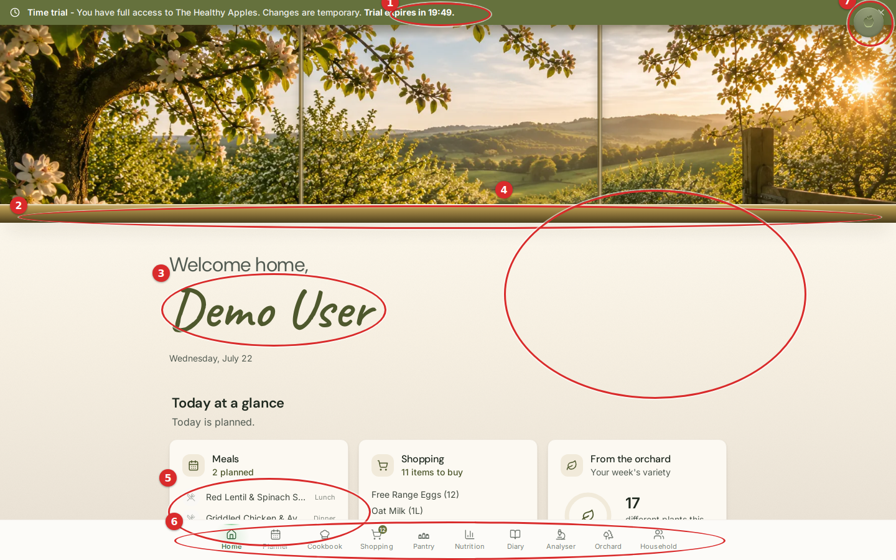

**1 — The trial banner ticks down by the second ("Trial expires in 19:49").**
*Wrong:* the very first thing in the home is a live, second-by-second countdown clock. *Why:* a ticking timer injects urgency and low-grade anxiety into the one room that exists to feel calm and welcoming — it is the opposite of hospitality, and it is the loudest thing on the screen at the moment of arrival. *Suggested:* keep the honest "changes are temporary" message, but remove the live countdown (or reduce it to a quiet, static "trial" line); a welcome should never open with a clock running out.

**2 — The gold "windowsill" band is a heavy, slightly muddy horizontal seam.**
*Wrong:* a thick, saturated bronze bar cuts straight across the page under the hero. *Why:* it carries far too much visual weight for what it is (a transition), and its hard edge saws the composition in two, breaking the calm dissolve from view to room. *Suggested:* thin it and lower its saturation so the orchard settles into the page like light, not like a painted ledge.

**3 — The handwritten name dwarfs everything.**
*Wrong:* "Demo User" in script is the single largest element in the content area — bigger than "Today at a glance" and bigger than any actual information. *Why:* proportion and hierarchy invert — the eye lands on a decorative name, not on what today holds. The delight of a signature is real, but at this scale it stops being a grace note and becomes the headline. *Suggested:* drop the script one size step so the reading order is greeting → date → today's plan, not name-first.

**4 — The entire right half of the arrival is empty.**
*Wrong:* the greeting and cards hug the left; the right ~45% is a void. *Why:* balance — on a wide screen the composition is heavily left-weighted and reads as *unfinished* rather than *airy*. Surplus space should become "air and view"; here nothing anchors it, so it becomes absence. *Suggested:* either centre the arrival column, or let one calm element (a sign of life, the orchard) hold the right so the space feels intended.

**5 — The "glance" content is truncated at the fold.**
*Wrong:* the first real content — tonight's meals — is clipped ("Griddled Chicken & Av…", "different plants this…") and only half a card row survives above the fold. *Why:* the hero + oversized greeting eat so much vertical space that a *glance* now requires a scroll, which defeats the card's whole purpose. *Suggested:* reduce hero height so at least one full card row is legible on arrival.

**6 — Ten doors in a phone-style bottom bar.**
*Wrong:* Home, Planner, Cookbook, Shopping, Pantry, Nutrition, Diary, Analyser, Orchard, Household — ten equally-weighted tabs crammed into a bottom nav on a 1440px screen. *Why:* simplicity and hierarchy collapse — everything is the same weight so nothing is primary, the labels are tiny, and a mobile chrome pattern is stretched across a desktop. *Suggested:* on wide screens promote to a calmer top/side navigation, and give the primary rooms priority over the secondary ones.

**7 — The Companion launcher is nearly invisible and collides with the banner close.**
*Wrong:* THA's signature feature (Apple) is a faint grey disc tucked into the top-right corner, right beside the banner's × close. *Why:* visual weight — the most distinctive thing in the product has the least presence, and it sits on top of an unrelated dismiss control. *Suggested:* give the Companion a warmer, clearer resting state and separate it from the close affordance.

---

## 2 · Cookbook  ·  `/cookbook`

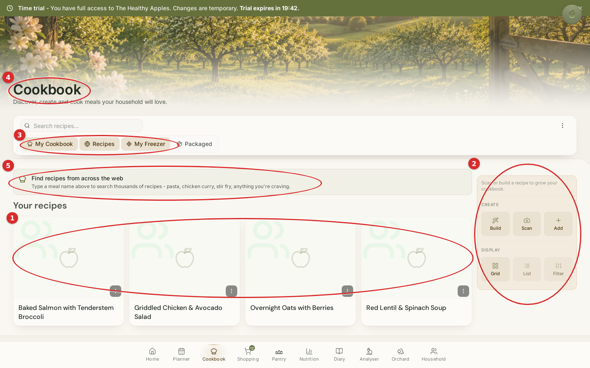

**1 — Every recipe shows the same empty placeholder ghost.**
*Wrong:* all four recipe cards carry an identical grey "two people + apple" outline instead of the dish. *Why:* delight and warmth — a cookbook lives on the appetite that food photography creates; four identical grey ghosts read as *broken* or *unloaded*, and they make named, real recipes look empty. This is the single biggest missed-delight moment in the product. *Suggested:* show real dish imagery, or at minimum a warm, *varied* per-recipe illustration so the shelf looks cooked-in.

**2 — The right-hand action rail looks disabled.**
*Wrong:* the CREATE (Build / Scan / Add) and DISPLAY (Grid / List / Filter) controls float in a washed-out grey column. *Why:* hierarchy and visual weight — the primary creative act (Build a recipe) looks greyed-out and inactive, and mixing *creation* controls with *view* controls in one faint stack hides both. *Suggested:* strengthen the primary create action's contrast and separate "make something" from "change the view".

**3 — Three filter chips look selected at once.**
*Wrong:* My Cookbook, Recipes and My Freezer all appear filled/active while Packaged does not. *Why:* simplicity — the selected state doesn't communicate one clear mode, so it's unclear whether these are a filter, a toggle set, or tabs. *Suggested:* make the active state unambiguous and single-meaning.

**4 — The room title is low-contrast on the washed hero.**
*Wrong:* "Cookbook" and its subtitle sit over a pale hero with weak contrast. *Why:* typography and hierarchy — the room's own name, the anchor of the page, is the hardest thing to read. *Suggested:* guarantee title contrast over imagery (a soft scrim or more type weight).

**5 — The "Find recipes from across the web" banner competes with "Your recipes".**
*Wrong:* a full-width promotional strip sits between the filters and the household's own recipes. *Why:* hierarchy — a discovery prompt is given more visual weight than the owner's actual cookbook, which should be the hero of *their* room. *Suggested:* quiet the web-search banner so "Your recipes" reads first.

---

## 3 · Planner  ·  `/planner`

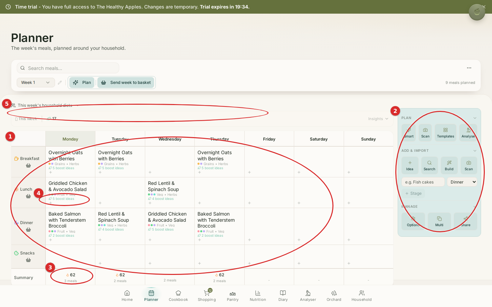

**1 — The week reads like a spreadsheet, not a family table.**
*Wrong:* a dense 7×4 grid of tiny type, colour dots, repeated "+" cells and "N boost ideas" links. *Why:* simplicity, whitespace and warmth all suffer — this is the "family planning table", but it presents as a data grid with no room to breathe. Every cell is doing three jobs. *Suggested:* increase cell padding, cut the per-cell metadata, and let empty days feel like open evenings rather than blank database rows.

**2 — A wall of eleven icon-buttons in the side rail.**
*Wrong:* PLAN (Smart/Scan/Templates/Analyse), ADD & IMPORT (Idea/Search/Build/Scan), MANAGE (Options/Multi/Share) — ~11 equally-weighted buttons in a tinted panel. *Why:* visual weight and hierarchy — too many co-equal actions with no single primary; the owner can't find *the* thing to do. *Suggested:* surface one primary action and progressively reveal the advanced tools.

**3 — Flame-numbers under each day read as a score.**
*Wrong:* a "🔥 62" figure sits under each day's summary. *Why:* it looks like a streak/score on the household's week, which is exactly the game-like grading a calm household planner should avoid; even if it's calories, the flame framing makes it feel like a verdict. *Suggested:* de-emphasise, label plainly, and drop the flame connotation.

**4 — "N boost ideas" repeated in every populated cell.**
*Wrong:* "5 boost ideas", "4 boost ideas" appear under nearly every meal. *Why:* repetition creates noise and pulls the eye away from the meal names, which are what matter. *Suggested:* collapse into a single, quieter affordance per day or on hover.

**5 — A cluttered sub-toolbar above the grid.**
*Wrong:* "This week's household diets ▾", "This Week", a "17" leaf count, and an "Insights ▾" all stack in one busy strip. *Why:* hierarchy — several controls of different kinds share one line with no grouping, so none reads clearly. *Suggested:* consolidate and give the strip one clear job.

---

## 4 · Pantry  ·  `/pantry`

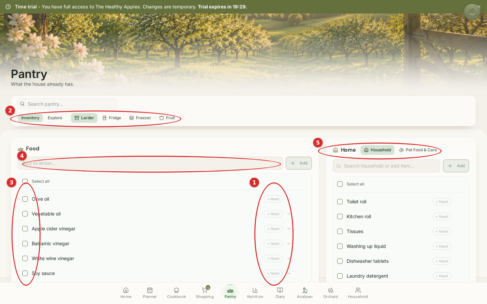

**1 — A "+ Need" pill on every single row.**
*Wrong:* every item, in both columns, carries a "+ Need" pill and a chevron. *Why:* visual weight — the repeated controls create a wall of noise down the right of each list; the eye can never rest on the items themselves. *Suggested:* reveal "+ Need" on hover/selection rather than persistently on every row.

**2 — Six sub-tabs for "what the house has".**
*Wrong:* Inventory / Explore / Larder / Fridge / Freezer / Fruit — six segmented tabs, plus three more (Home / Household / Pet Food & Care) on the right. *Why:* simplicity and hierarchy — nine navigational choices for one pantry is more structure than the task needs. *Suggested:* consolidate the storage locations and reduce the segment count.

**3 — Rows of empty hollow checkboxes dominate.**
*Wrong:* long columns of unchecked square boxes lead every row. *Why:* visual weight — the hollow boxes are the heaviest repeated mark on the page, so the list reads as an unfinished to-do rather than "what we already have". *Suggested:* soften the unchecked state so items, not checkboxes, carry the weight.

**4 — Two different input styles for the same action.**
*Wrong:* the left uses "Add to larder…" with an Add button; the right uses "Search household or add item…" with a different treatment. *Why:* simplicity — the same "add an item" gesture looks like two different features across one room. *Suggested:* unify the add-item control.

**5 — A second row of segment tabs on the right column.**
*Wrong:* Home / Household / Pet Food & Care sits as its own tab set beside the left column's six. *Why:* the room now has two competing tab systems on one screen, doubling the navigational load. *Suggested:* fold these into one consistent structure.

---

## 5 · Shopping  ·  `/shopping-workspace`

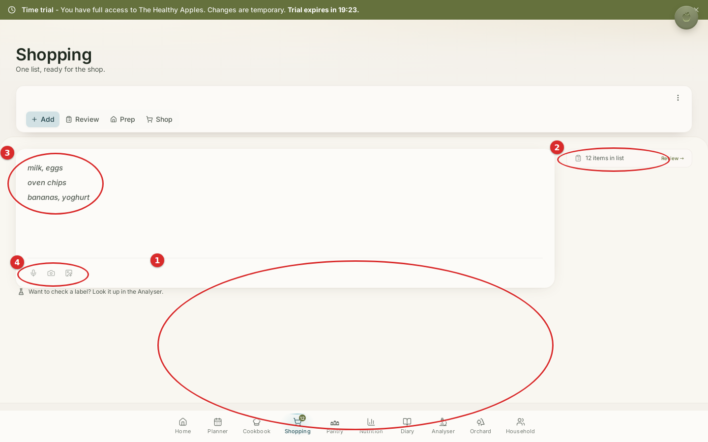

**1 — A vast empty void below the list.**
*Wrong:* three short lines sit in a large card, and ~40% of the screen beneath is empty beige. *Why:* balance and proportion — the room feels barren and unfinished on desktop; the emptiness reads as a layout gap, not as calm. *Suggested:* size the card to its content and centre the composition so the space is intended.

**2 — "12 items in list" but only three lines are shown.**
*Wrong:* the side panel claims 12 items while the visible list is "milk, eggs / oven chips / bananas, yoghurt". *Why:* trust and clarity — the number on screen contradicts what's on screen; an owner immediately doubts the count. *Suggested:* reconcile the figure with the visible list (or explain the difference).

**3 — Entered items look like faint placeholder text.**
*Wrong:* the real list items render as pale grey italic. *Why:* typography and hierarchy — the household's actual content is styled like a ghost hint, so it reads as *not yet entered*. *Suggested:* give committed items confident, dark weight so they clearly *are* the list.

**4 — The capture tools are tiny and near-invisible.**
*Wrong:* the mic / camera / image buttons under the list are small and very low-contrast. *Why:* visual weight — genuinely useful, characterful inputs (speak your list, snap a label) are the faintest things on the page. *Suggested:* give them enough presence to be discovered.

---

## 6 · Diary  ·  `/my-diary`

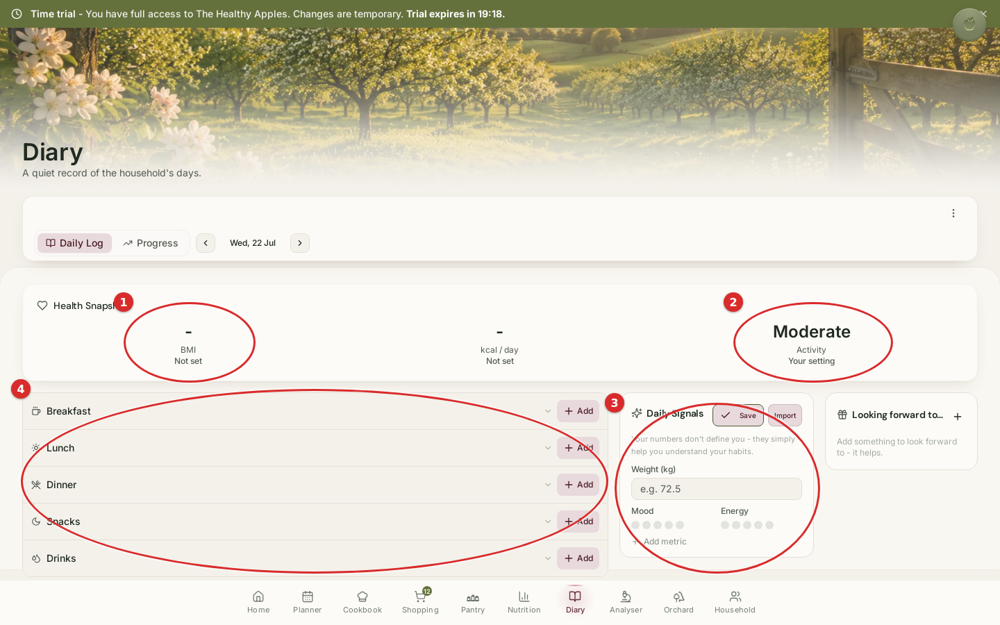

**1 — The room greets you with two blank dashes.**
*Wrong:* "Health Snapshot" leads with "– BMI · Not set" and "– kcal/day · Not set". *Why:* warmth — a "quiet record of the household's days" opens with empty clinical stats and literal dashes, which is exactly the cold/clinical/empty temperature the house is meant never to feel. *Suggested:* replace the dashes with a gentle invitation, or hide unset metrics until there's something to show.

**2 — The only filled stat is the least meaningful, and it's the boldest.**
*Wrong:* "Moderate · Activity" is large and confident while the two health numbers are blank. *Why:* hierarchy and balance — visual emphasis lands on the one value that carries the least for the owner, purely because it happens to be set. *Suggested:* balance the three so emphasis follows meaning, not availability.

**3 — "Daily Signals" reads as a clinical data-entry form.**
*Wrong:* Weight (kg), Mood dots and Energy dots presented as an input panel. *Why:* warmth and hospitality — leading a *diary* with a weight field feels like a health tracker, not a household's record; it's the clinical note the palette warns against. *Suggested:* soften it, make it clearly optional, and let it sit secondary to the day itself.

**4 — Five empty meal accordions stacked with "Add".**
*Wrong:* Breakfast / Lunch / Dinner / Snacks / Drinks all appear collapsed and empty with an "Add" each. *Why:* whitespace and warmth — a column of five empty rows reads as chores waiting, not as a day being remembered. *Suggested:* let the day open in a warmer, less form-like state.

---

## 7 · Nutrition  ·  `/nutrition`

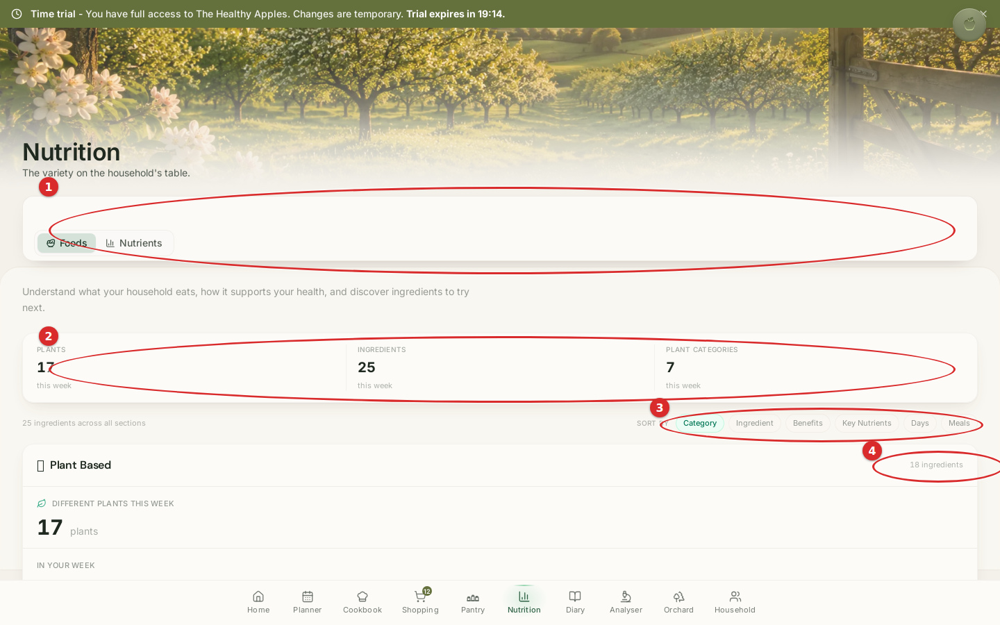

**1 — A large empty panel holding only two small tabs.**
*Wrong:* a big rounded container spans the width but contains just the Foods / Nutrients toggle. *Why:* proportion and whitespace — a heavy container wrapping tiny content wastes weight and creates a hollow band at the top of the room. *Suggested:* shrink the container to its content or inline the tabs.

**2 — Number soup.**
*Wrong:* "17 plants", "25 ingredients", "7 categories" and then "18 ingredients" all appear within a small area. *Why:* hierarchy — several similar figures compete, and the owner can't tell which one is the point of the room. *Suggested:* lead with one headline metric and demote the rest.

**3 — Six "sort by" chips.**
*Wrong:* Category / Ingredient / Benefits / Key Nutrients / Days / Meals in one chip row. *Why:* simplicity — six sort modes is a lot of choice to present at once for a browsing room. *Suggested:* reduce or tuck the less-used modes away.

**4 — A visible 17-vs-18 mismatch.**
*Wrong:* the header says "17 plants this week" while the section below reads "18 ingredients" (and "17 plants"). *Why:* trust — two adjacent counts that don't line up make the owner distrust all of them. *Suggested:* reconcile the figures or make clear they measure different things.

---

## 8 · Analyser  ·  `/analyser`

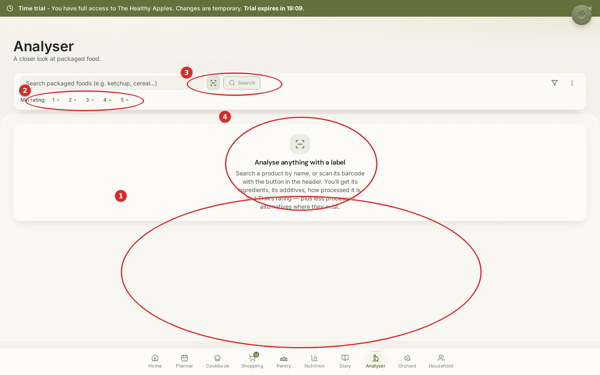

**1 — The room is mostly empty space.**
*Wrong:* a single small empty-state card floats near the top and ~60% of the screen below is blank. *Why:* balance and proportion — on desktop the room feels barren and the empty-state looks lost rather than composed. *Suggested:* centre the empty state vertically, or fill the space with a few tappable example lookups so the room feels helpful, not vacant.

**2 — The "Min rating" filter is tiny and cryptic.**
*Wrong:* "Min rating: 1 2 3 4 5" with minuscule apple marks crammed under the search field. *Why:* typography and proportion — it's hard to read and doesn't announce itself as a filter. *Suggested:* enlarge and clarify it, or hide it until a search is active.

**3 — Search and scan look disabled.**
*Wrong:* the search field, Search button and scan control read as greyed/inactive. *Why:* visual weight — the room's primary action looks turned off before you've done anything. *Suggested:* give the primary search a confident, clearly-active state.

**4 — The empty-state icon is a generic grey glyph.**
*Wrong:* a plain grey scan-frame icon anchors the empty state. *Why:* delight — a signature "analyse anything with a label" moment is represented by the most generic mark available. *Suggested:* warm it up so first contact with the room has character.

---

## 9 · Profile / Household  ·  `/profile`

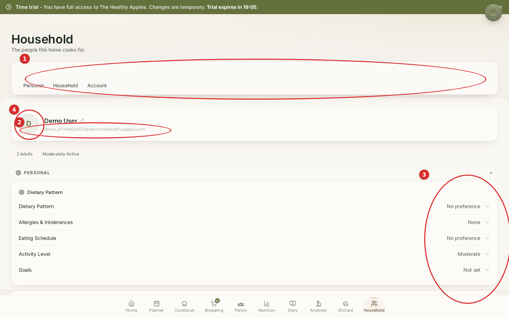

**1 — A large empty panel holding only three tabs.**
*Wrong:* the same hollow-container pattern as Nutrition — a wide box wrapping just Personal / Household / Account. *Why:* proportion and whitespace — heavy frame, tiny content, a wasted band at the top of the room. *Suggested:* size the container to the tabs.

**2 — A raw machine email is shown under the name.**
*Wrong:* "demo_a1134862af01@demo.thehealthyapples.com" sits directly beneath "Demo User". *Why:* warmth and trust — an ugly system-generated string breaks the human, hospitable tone the rest of the product works hard to hold. *Suggested:* hide system identifiers, or present something a person would recognise as theirs.

**3 — A wall of "No preference / None / Not set".**
*Wrong:* Dietary Pattern "No preference", Allergies "None", Eating Schedule "No preference", Goals "Not set" stack down the room. *Why:* warmth — the room reads as empty and administrative, a settings form full of blanks rather than a portrait of the people the home cooks for. *Suggested:* turn blanks into gentle, optional invitations, or hide the unset ones.

**4 — The person is a plain initial disc.**
*Wrong:* the household's owner is represented by a grey "D" circle. *Why:* delight — "the people this home cooks for" is the warmest promise in the app, and it opens with the coldest possible avatar. *Suggested:* give the person a warmer default presence.

---

## 10 · Companion (Apple)  ·  floating

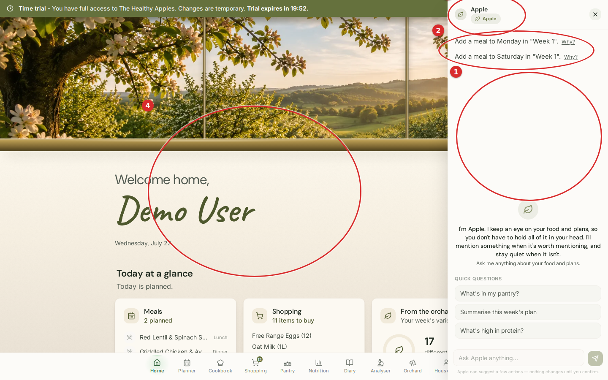

**1 — A large empty gap floats in the middle of the panel.**
*Wrong:* between the two top suggestion lines and the centred "I'm Apple…" introduction sits a big vertical void. *Why:* balance and whitespace — the greeting floats in the middle of nowhere and the panel feels half-loaded. *Suggested:* anchor the introduction to the top (or fill the space) so the conversation reads top-down.

**2 — Proactive suggestions render as plain grey text with "Why?" links.**
*Wrong:* "Add a meal to Monday in Week 1. Why?" and its sibling look like leftover body text. *Why:* hierarchy and visual weight — the Companion's most valuable move (noticing something for you) has the least design care and looks un-tappable. *Suggested:* give the suggestions a gentle card affordance so they read as offers, not stray sentences.

**3 — "Apple" is labelled twice, stacked.**
*Wrong:* the panel header says "Apple", and a pill immediately beneath it also says "Apple". *Why:* simplicity — redundant labelling in the tightest, most-read corner of the surface. *Suggested:* remove the duplicate.

**4 — The panel barely dims the room behind it.**
*Wrong:* opening the Companion leaves Home almost fully lit beside it. *Why:* hierarchy — the scrim is too weak to say "you're in a conversation now", so attention is split between the drawer and the room. *Suggested:* deepen the scrim so the Companion clearly takes focus while it's open.

---

## 11 · Community / Orchard  ·  `/orchard`

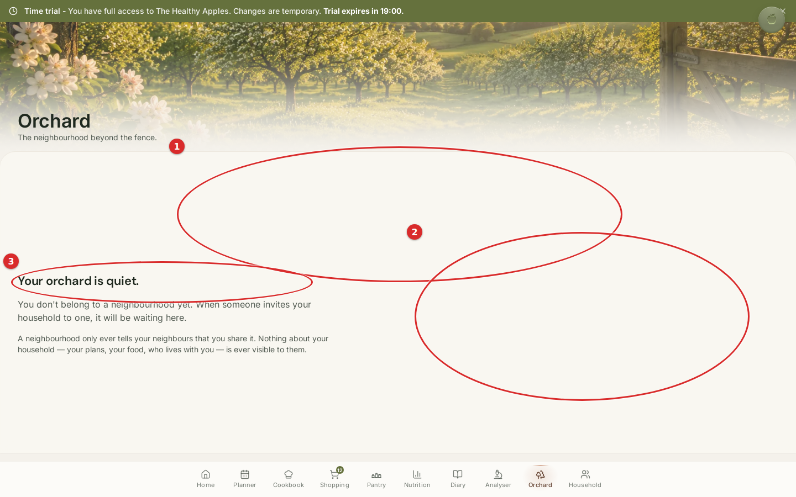

**1 — A large empty gap between the hero and the message.**
*Wrong:* a tall band of blank white separates the orchard hero from the "Your orchard is quiet" copy. *Why:* balance and whitespace — the emptiness reads as a spacing bug, not as calm; the two halves of the screen don't relate. *Suggested:* tighten the vertical rhythm so the empty state sits close under its hero.

**2 — The empty state is jammed into the left third; the right two-thirds is blank.**
*Wrong:* the copy hugs the far left while ~60% of the width is unused. *Why:* balance — the composition is badly left-weighted and feels off-kilter on a wide screen. *Suggested:* centre the empty state so it feels composed and cared-for.

**3 — The room's best asset — the copy — is under-presented.**
*Wrong:* "Your orchard is quiet." followed by the reassuring privacy line ("Nothing about your household… is ever visible to them") is genuinely lovely, but it's set small and pushed to the corner. *Why:* delight and hierarchy — the warmest, most trust-building writing in the room is given the least presence. *Suggested:* let this copy be the composed centre of the empty state; it earns the space.

---

## Overall score

## **7 / 10**

A genuinely characterful, warm product with a rare and consistent point of view — the orchard, the light, the writing, and the Companion's voice are award-*worthy* raw material and comfortably above the category. It is held back from the top tier by a cluster of *finishing* problems that an Apple Design Award jury would circle immediately: a welcome that opens with a ticking countdown; desktop layouts that leave half the screen empty and off-balance; several rooms that greet the owner with blanks, dashes and disabled-looking controls; missing food photography in the one room that most needs it; number mismatches that quietly cost trust; and a ten-door bottom nav that flattens all hierarchy. None of these are structural — they are the last 15% that separates *lovely* from *unforgettable*. Fix the top ten and this is a 9.

---

## Top 20 improvements — priority order

1. **Stop the countdown.** Remove the live, per-second trial timer from the Home banner; keep the honest "changes are temporary" line only. *(Home 1)*
2. **Give recipes real (or varied) imagery.** Replace the four identical placeholder ghosts in Cookbook. *(Cookbook 1)*
3. **Fix the empty desktop balance.** Centre or anchor the arrival composition on Home, Shopping, Analyser and Orchard so the right/lower voids become intentional. *(Home 4, Shopping 1, Analyser 1, Orchard 2)*
4. **Rescue the "glance."** Reduce the Home hero/greeting height so at least one full card row is visible on arrival. *(Home 5)*
5. **Reconcile every count.** "12 items" vs 3 shown (Shopping); "17 vs 18" (Nutrition). Numbers on screen must match what's on screen. *(Shopping 2, Nutrition 4)*
6. **Rehome the navigation on desktop.** Move the 10-door bottom bar to a calmer top/side nav with real hierarchy. *(Home 6)*
7. **Warm up the blank rooms.** Replace "– / Not set / No preference / None" walls in Diary and Household with gentle invitations or hide unset values. *(Diary 1, Household 3)*
8. **Make committed content look committed.** Darken entered Shopping items so they don't read as placeholder. *(Shopping 3)*
9. **De-clinicalise the Diary.** Demote weight/mood/energy; lead the "quiet record" with the day, not with metrics. *(Diary 3)*
10. **Give the Companion presence.** Strengthen the launcher, separate it from the banner close, and deepen its scrim when open. *(Home 7, Companion 4)*
11. **Calm the Planner grid.** More cell padding, less per-cell metadata, breathing room in empty days. *(Planner 1)*
12. **Thin the Home "windowsill" band.** Lower its weight and saturation so the hero dissolves into the room. *(Home 2)*
13. **Reduce the icon-button walls.** Progressive disclosure with one clear primary action in the Planner and Cookbook rails. *(Planner 2, Cookbook 2)*
14. **Right-size the hollow containers.** Shrink the empty panels wrapping tabs on Nutrition and Household. *(Nutrition 1, Household 1)*
15. **Rebalance the script greeting.** Reduce "Demo User" a size step so hierarchy runs greeting → today. *(Home 3)*
16. **Remove the flame "scores" from the Planner.** Re-label plainly; drop the game-like connotation. *(Planner 3)*
17. **Cut repeated controls.** "+ Need" on every Pantry row and "N boost ideas" in every Planner cell → reveal on hover/selection. *(Pantry 1, Planner 4)*
18. **Hide the machine email** under the household name. *(Household 2)*
19. **Consolidate over-tabbed rooms.** Pantry's 6+3 tabs and clarify Cookbook's ambiguous chip selection. *(Pantry 2 & 5, Cookbook 3)*
20. **Guarantee title contrast** over the washed heroes (Cookbook, Nutrition, and siblings). *(Cookbook 4)*

---

## "If this were my product, I would change these first."

If this were my product, before I let anyone judge it I would do exactly five things, in this order:

1. **Kill the ticking countdown on Home.** Nothing else matters if the first breath a household takes in the house is a clock running out. A home says *welcome*, never *hurry*.
2. **Put food in the Cookbook.** Four identical grey ghosts is the one thing a jury would photograph as "unfinished." A cookbook has to make you hungry.
3. **Own the empty half of every desktop screen.** Centre and compose the arrivals so Home, Shopping, Analyser and Orchard feel *calm*, not *abandoned*. Right now the whitespace reads as a bug, and the house's best principle — surplus space becomes air and view — is being spent as emptiness instead.
4. **Delete every blank, dash and "Not set" the owner meets on arrival.** In Diary and Household especially: turn blanks into warm, optional invitations, and never greet a family with a "– BMI".
5. **Make the numbers tell the truth.** Reconcile "12 items / 3 shown" and "17 / 18." A single mismatched count quietly taxes trust in *everything* else the product says — and trust is the one thing this product cannot afford to spend.

Do those five, and the score moves from *7 — lovely* to *9 — award-worthy*, because the soul is already here. What's missing is only the finish.

---

### Appendix · Method & artefacts

- **Session:** seeded demo household (`POST /api/demo/start`), onboarding complete, real seeded meals/plan/pantry/shopping data.
- **Viewport:** 1440×900, one arrival view per room (the "first breath" of each room — the moment an Apple Design Award jury judges).
- **Rooms captured:** Home, Cookbook, Planner, Pantry, Shopping, Diary, Nutrition, Analyser, Household (Profile), Companion, Orchard (Community). All eleven were live and populated.
- **Annotated assets:** `docs/investigations/HOMEOWNER2_assets/*_annotated.png` (clean captures alongside, same basename without `_annotated`).
- **Constraint honoured:** no code was modified; this is critique only — no redesign, no implementation, no invented features.
